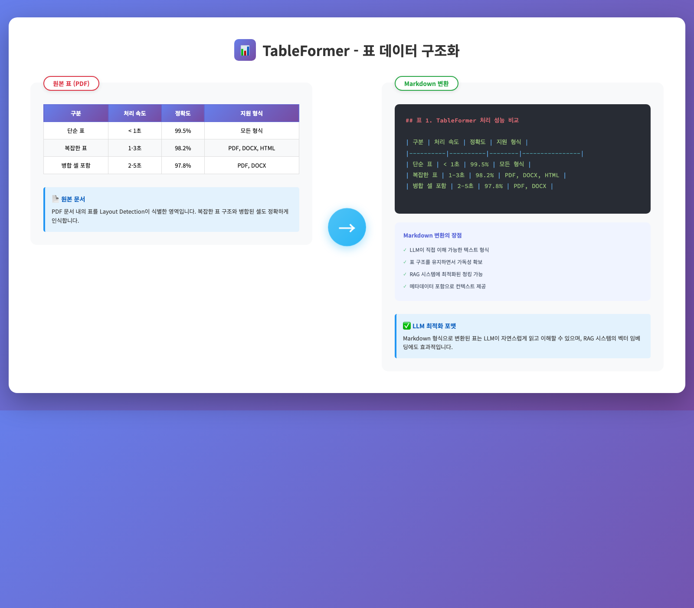

# Genos 전처리기

## 🎯 RAG 시스템의 전처리 필요성

### 원본 문서의 구조적 복잡성

기업 환경에서 처리하는 문서는 복잡한 레이아웃, 표, 그래프, 다단 구성 등 다양한 형식적 요소를 포함합니다.


*복잡한 문서 구조: 다단 레이아웃, 표, 차트, 각주 등*

**전처리 없이 RAG 수행 시 발생하는 문제:**
- 표 구조 파괴로 인한 데이터 의미 손실
- 제목과 본문 미구분으로 인한 맥락 파악 불가
- 이미지 캡션 분리로 인한 정보 손실
- 다단 구성 혼재로 인한 문장 연결성 파괴

### 해결 방안: 지능형 문서 전처리

Genos 전처리기는 문서의 구조적 특성을 분석하여 문제 상황에 최적화된 데이터로 변환합니다.

## 📋 Genos 전처리기 체계

Genos는 문서 유형 및 문제 상황 별로 4가지 전처리기를 제공합니다. 각 전처리기는 상황 및 특정 문서 유형의 특성을 고려한 처리 알고리즘을 적용합니다.

### 1. 적재용(외부) 지능형 문서 전처리기

**적용 대상**: 복잡한 구조를 가진 PDF 문서

**핵심 장점:**
- **정밀한 구조 분석**: 딥러닝 모델 기반 문서 구조 분석
- **복잡한 표 처리**: 병합 셀, 계층적 헤더 구조 인식
- **의미 기반 청킹**: 문서 구조와 토큰 제한을 고려한 지능형 분할
- **OCR 자동 수행**: 스캔 문서나 GLYPH 오류 시 자동 텍스트 인식

**처리 프로세스**:

#### 🔍 Layout Detection - 문서 구조 이해


*AI 모델이 문서 요소를 자동 식별: TITLE, SECTION_HEADER, TEXT, TABLE, PICTURE 등*

Layout Detection은 딥러닝 모델을 활용하여 문서의 시각적 구조를 분석하고 각 요소의 유형을 식별합니다.

**식별 가능한 문서 요소:**
- **Title**: 문서 제목
- **Section Header**: 장/절 제목
- **Text**: 본문 텍스트
- **Table**: 표 형식 데이터
- **Picture**: 이미지, 차트, 도표
- **Caption**: 표/그림 설명

#### 📊 TableFormer - 복잡한 표도 완벽 복원


*복잡한 표를 구조화된 데이터로 변환: 병합 셀, 계층적 헤더를 Markdown으로 변환*

**Layout Detection과 TableFormer의 연계 처리:**

```
1단계: Layout Detection
표 영역의 좌표 식별 (예: bounding box coordinates)
        ↓
2단계: TableFormer
식별된 영역 내 표 구조 분석
(행/열 구성, 헤더 구조, 셀 병합 관계 파악)
```

Layout Detection이 표의 위치를 찾아내면, TableFormer가 해당 영역의 상세 구조를 분석하는 2단계 파이프라인으로 작동합니다.

#### 🔮 Enrichment - LLM 기반 메타데이터 추출

**Enrichment의 필요성**

문서의 원시 데이터만으로는 파악하기 어려운 메타데이터를 LLM으로 추출하여 검색 품질과 문서 활용도를 향상시킵니다.

**주요 Enrichment 기능:**

##### 1. 목차 생성 (TOC Enrichment)
- **문서 구조 분석**: AI가 문서 전체를 읽고 계층 구조 파악
- **섹션 자동 식별**: "제1장", "제1절", "1.1" 등 다양한 형식 인식
- **동적 목차 구성**: 문서 유형에 맞는 최적 목차 생성

##### 2. 작성일 메타데이터 추출
- **날짜 표현 인식**: "2024.05.10", "2024년 5월", "24/5/10" 등 다양한 형식
- **우선순위 적용**: "작성일" > "보고자료 날짜" > "최종수정일" 순
- **정규화 처리**: YYYYMMDD 형식(20240510)으로 통일 저장

#### 🧩 지능형 청킹 - 의미 단위 분할

**청킹의 필요성**

LLM의 컨텍스트 윈도우 제한으로 인해 대용량 문서는 적절한 크기로 분할이 필요합니다. 단순한 길이 기반 분할은 의미 단위를 파괴하여 정보 손실을 야기합니다.

**청킹 처리 시나리오:**

##### 시나리오 1: 회사 규정 문서 (100페이지)

```
📄 인사 규정
├─ 제1장 총칙 (2페이지)
├─ 제2장 채용 (15페이지)
│  ├─ 2.1 채용 절차
│  ├─ 2.2 채용 기준표 [대형 표]
│  └─ 2.3 서류 양식
└─ 제3장 근태관리 (20페이지)
```

**일반 청킹의 문제:**
- ❌ "2.1 채용 절차"가 중간에 잘림
- ❌ 표가 반으로 쪼개져 표 구조에 대한 의미 상실

**Genos 지능형 청킹:**
- ✅ 청크 1: "제1장 총칙" 전체 (작아서 하나로)
- ✅ 청크 2: "제2장 > 2.1 채용 절차" (상위 정보 포함)
- ✅ 청크 3: "제2장 > 2.2 채용 기준표" (표 전체 보존)

##### 시나리오 2: API 매뉴얼의 거대한 표

```
| 엔드포인트 | 메소드 | 파라미터 | 응답 | 설명 |
|-----------|--------|---------|------|------|
| /user/login | POST | id, pw | token | ... |
| ... 498개 더 ... |
```

**Genos 처리:**
- 표가 아무리 커도 4,096 토큰까지는 하나로 유지
- 표 구조를 Markdown으로 완벽 보존
- 검색 시 표 전체 정보 제공

##### 시나리오 3: 연구 보고서의 계층 구조

```
1. 서론 (500 토큰)
2. 선행연구
   2.1 국내 연구 (800 토큰)
   2.2 해외 연구 (900 토큰)
```

**토큰 누적 과정** (한계: 2,000 토큰):
- "1. 서론" (500) + "2.1 국내 연구" (800) = 1,300 ✅
- 1,300 + "2.2 해외 연구" (900) = 2,200 ❌ 초과!

**결과:**
- 청크 1: "1. 서론" + "2. 선행연구"(상위 헤더) + "2.1 국내 연구"
- 청크 2: "2. 선행연구"(상위 헤더) + "2.2 해외 연구"
  (상위 헤더 "2. 선행연구"를 반복 포함하여 계층적 문맥 유지)

##### 시나리오 4: 짧은 섹션들의 병합

```
## 5. 참고사항
### 5.1 약어 (50 토큰)
### 5.2 용어 정의 (100 토큰)
### 5.3 단위 설명 (80 토큰)
```

**Genos 처리:**
- 각각 너무 작아서 개별 청크로 만들면 비효율
- 모두 합쳐도 230 토큰이므로 하나로 병합
- 결과: "5. 참고사항" 전체를 하나의 청크로

### 2. 적재용(내부) 문서 전처리기

**적용 대상**: 한국은행(BOK) 내부 구조화 JSON 데이터

**처리 특성**

한국은행 내부 시스템의 구조화된 JSON 데이터를 효율적으로 처리합니다. 이미 구조화된 데이터를 활용하여 빠른 처리 속도와 고객 친화적인 검색 결과를 제공합니다.

**핵심 장점:**
- **고속 처리**: 이미 구조화된 JSON 데이터를 직접 활용
- **정확한 메타데이터**: 사전 정의된 필드 구조 활용 가능
- **효율적 검색**: 구조화된 데이터로 정밀한 검색 지원

### 3. 적재용(규정) 지능형 문서 전처리기

**적용 대상**: 규정, 법령 등의 PDF 문서

**처리 특성**

규정 문서의 계층적 구조를 보존하면서 의미 단위로 청킹을 수행합니다. 청킹 알고리즘을 통해 문단 내부의 일부 텍스트가 헤더 정보를 포함하고 있는 문서의 계층 구조를 추적하고 토큰 제한을 고려한 최적 분할을 수행합니다.

**핵심 기능:**
- **목차 자동 생성**: LLM 기반으로 "제1장", "제1절", "제1조" 등 규정 특화 계층 구조 enrichment
- **의미 기반 청킹**: 법률 문서 구조와 토큰 제한을 고려한 지능형 분할
- **OCR 지원**: GLYPH 문제 발생 시 자동 OCR 수행

### 4. 첨부용 문서 전처리기

**적용 대상**: LLM을 활용한 채팅 중 첨부할 문서

**처리 특성**

실시간 활용을 위해 복잡한 분석 과정을 생략하고 텍스트 추출에 집중합니다.

**처리 방식 비교:**

```
적재용 처리 (정밀 분석):
1. 문서 구조 분석
2. 표 구조 복원
3. 이미지 처리
4. 메타데이터 추출
→ 처리 시간: 1~3분

첨부용 처리 (고속 추출):
1. 텍스트 즉시 추출
2. 기본 구조 인식
3. 이미지 처리 생략
4. 최소 메타데이터
→ 처리 시간: 5~10초
```

**핵심 장점:**
- **초고속 처리**: 분석 단계 최소화
- **텍스트 중심**: 핵심 내용 즉시 추출
- **즉시 활용**: 처리 완료 즉시 질문 가능