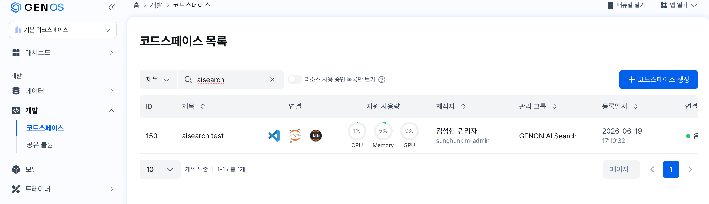
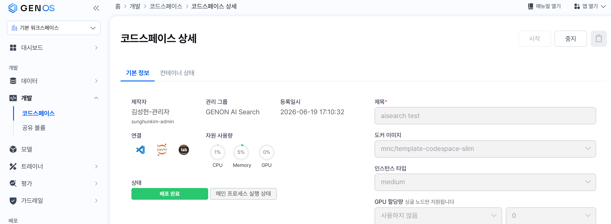
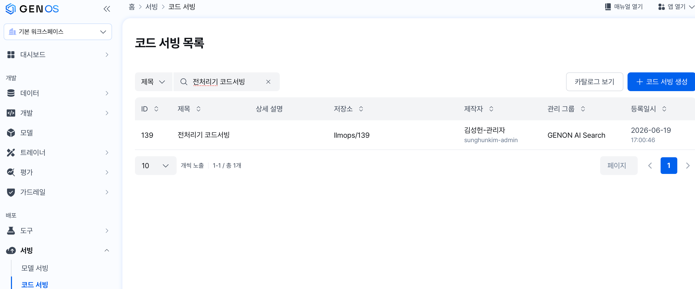
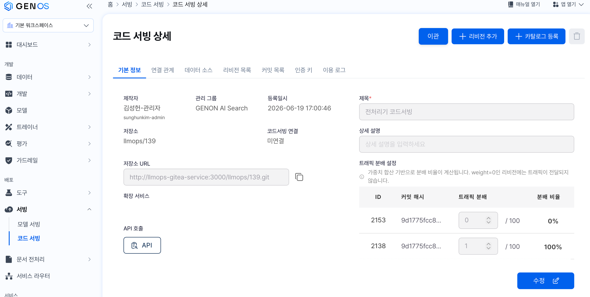
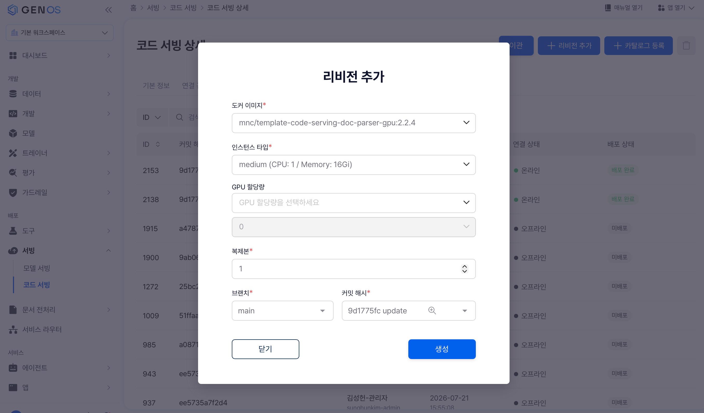

# Genos 코드서빙 전처리기 개발 매뉴얼

Genos 코드서빙으로 배포된 **문서 전처리기(doc parser)** 의 설정과 코드를 수정하고 재배포하는 방법을
다룹니다. Genos를 처음 접하는 개발자를 대상으로 합니다.

전처리기 코드서빙은 **이미 배포되어 동작하고 있습니다.** 이 문서는 실행 중인 전처리기를 우리
요구에 맞게 고치는 방법을 다룹니다. 도커 이미지를 빌드하는 일은 없습니다.

> **모니모 환경은 이 문서가 아닙니다.** Bitbucket과 전용 CI/CD로 배포하는 환경은 같은 폴더의
> `code_serving_dev_manual_monimo.md`를 보세요. 1·2·5·6장은 같고 개발환경과 배포 장만 다릅니다.

## 목차

- [0. 개요](#0-개요) — 사전 준비 항목 · 작업 흐름 · 작업 범위 · 엔드포인트
- [1. 새 문서 유형 추가하기](#1-새-문서-유형-추가하기) — `custom_field_*.yaml` 6단계
- [2. 코드 수정](#2-코드-수정) — facade 2개의 훅 메소드와 확장 지점
- [3. 개발 환경](#3-개발-환경) — 로컬 설치 · 검증 절차 · 코드스페이스
- [4. 재배포](#4-재배포) — gitea push → 리비전 배포 → 호출 검증
- [5. 구성 YAML 옵션](#5-구성-yaml-옵션) — 플레이스홀더 · 주요 구성 옵션
- [6. 주요 동작 방식](#6-주요-동작-방식) — 파싱 결과 2종 · 청킹 · 출력 스키마 · 코드 중복 범위
- 부록 [A 용어집](#부록-a-용어집) · [B 환경값과 문의처](#부록-b-환경값과-문의처) · [C 컨테이너 경로](#부록-c-컨테이너-경로환경변수) · [D 관련 문서](#부록-d-관련-문서) · [E 신규 생성](#부록-e-코드서빙코드스페이스-신규-생성) · [F 자주 쓰는 명령어](#부록-f-자주-쓰는-명령어)

---

## 0. 개요

### 0.1 사전 준비 항목

아래는 **이미 준비되어 있습니다.** 직접 만들 필요가 없습니다.

| 항목 | 상태 |
|---|---|
| Genos 플랫폼 | 설치·운영 중. 웹 UI 접속 가능 |
| LLM / VLM / OCR 모델 서빙 | Genos **모델 서빙**으로 등록되어 있음 |
| 코드서빙용 도커 이미지 | Genos **도커 이미지**로 등록되어 있음. 직접 빌드하지 않습니다 |
| 코드서빙(전처리기) | **이미 배포되어 동작 중.** 기본 동작하도록 초기 세팅 완료 |
| gitea 저장소 | 코드서빙 생성 시 함께 만들어져 있고, 동작하는 소스가 들어 있음 |

**작업 전에 확보해야 하는 값**입니다. 값 자체는 환경마다 다르고, 확인 위치는 [부록 B](#부록-b-환경값과-문의처)에 있습니다.

| 값 | 어디서 | 쓰는 곳 |
|---|---|---|
| Genos 웹 UI 주소 · 계정 | 담당자 | 4장 |
| gitea 저장소 URL | 코드서빙 상세 | [4.3](#43-gitea-저장소-clone) |
| 코드서빙 `serving_id` · 인증키 | 코드서빙 상세 | [4.7](#47-호출-검증) |
| 모델 서빙 ID · 인증키 | 모델 서빙 상세 | [3.6](#36-모델-서빙-연결-설정) |

> `<GENOS_HOST>`처럼 **꺾쇠로 감싼 값**은 "환경마다 다름, 직접 채워 넣으세요"를 뜻합니다.

### 0.2 작업 흐름

```
 [1장 또는 2장]  설정 또는 코드 수정
        │
 [3장]   facade 단독 실행으로 결과를 눈으로 확인          ← 수 초. 여기서 대부분 끝냅니다
        │
 [4장]   commit/push → 리비전 생성 → 배포
        │
 [4.7]   게이트웨이 호출로 반영 확인
```

배포는 소스 clone과 의존성 설치 때문에 몇 분 걸립니다.

### 0.3 작업 범위

| 하는 일 | 어디를 고치나 | 이 문서 |
|---|---|---|
| **새 문서 유형 추가** | `resource/custom_field_<유형>.yaml` + 등록 블록 | 1장 |
| 문서 유형별 옵션 조정 | facade의 `CONFIG_BY_DOC_TYPE` | [2.3](#23-문서-유형마다-설정을-다르게--config_by_doc_type) |
| 입력 데이터 구조 조정 | facade의 훅 메소드 | [2.4](#24-설정만으로-입력-데이터-구조를-처리할-수-없는-경우--훅-메소드) |
| 공통 동작 옵션 | `resource/*_processor_config.yaml` | 5장 |
| 재배포 | gitea push → 리비전 | 4장 |

### 0.4 코드서빙이란

"내가 만든 FastAPI 앱을 Genos 위에서 돌리는 기능"입니다. Genos는 미리 만들어 둔 도커
이미지를 실행하고, 런타임에 gitea 저장소를 컨테이너 안으로 clone 한 뒤 그 안의
`main.py`를 실행합니다.

즉 이미지에는 무거운 라이브러리만 들어 있고 실제 코드는 git에서 옵니다. 그래서 코드를 고칠 때
도커 이미지를 다시 빌드할 필요가 없습니다. git push 하고 리비전만 다시 만들면 됩니다.
파이썬 코드와 config yaml이 모두 git 저장소의 파일입니다. 웹 UI에 코드를 붙여넣는 방식이 아닙니다.

Genos의 서빙은 리비전 단위로 배포됩니다. 리비전 하나가 "도커 이미지 + 소스 커밋 + 인스턴스
사양 + 환경변수" 조합을 고정한 스냅샷입니다. **git push 만으로는 반영되지 않습니다.**

컨테이너가 기동할 때 벌어지는 일입니다. 아래 스크립트는 도커 이미지 안에 있고 저장소에는
없습니다. 찾지 마세요.

```
supervisord → entrypoint.sh
   │
   ├─ /app/.init_done.<COMMIT_HASH> 마커가 없으면 init.sh
   │     ├─ git clone <저장소> → /app/src/service
   │     ├─ git checkout <COMMIT_HASH>
   │     └─ requirements.txt가 있으면 pip install (이미지 가상환경 /app/.venv에 그대로)
   ▼
cd /app/src/service && uvicorn main:app --host 0.0.0.0 --port ${PORT:-8080}
```

짚어 둘 점이 세 가지입니다.

1. 소스가 놓이는 경로는 **`/app/src/service`** 입니다. 요청의 `file_path`는 이 경로가 기준입니다.
2. init은 커밋 해시마다 한 번만 실행됩니다. 같은 커밋으로 재시작하면 clone과 pip을 건너뜁니다.
3. **pip install이 실패해도 재시도되지 않습니다.** 경고만 남기고 마커가 생성됩니다. 의존성 문제는
   새 커밋으로 리비전을 다시 만들어 해결하세요. `git clone` 실패는 실제로 실패 처리됩니다.

> 리비전 설정에 `START_COMMAND` 나 `BUILD_COMMAND`가 있으면 위 기본 동작 대신 그것이 실행됩니다.
> 배포가 예상과 다르면 리비전에 이 값들이 들어 있는지 확인하세요.

### 0.5 엔드포인트

전처리기는 목적이 다른 facade 5개를 한 서버에 올립니다. **이 문서가 다루는 것은 파싱과 청킹
2종**이고, 나머지는 이름만 알아 두면 됩니다.

| 엔드포인트 | facade 파일 | 이 문서에서 |
|---|---|---|
| `POST /parser` · `/parser_upload` | `facade/parser_processor.py` | **주 대상** |
| `POST /chunker` | `facade/chunking_processor.py` | **주 대상** |
| `POST /preprocess` · `/preprocess_intelligent` | `intelligent_processor.py` | 옵션 레퍼런스는 `intelligent_processor.md` |
| `POST /preprocess_convert` | `convert_processor.py` | 〃 `convert_processor.md` |
| `POST /preprocess_attachment` | `attachment_processor.py` | 〃 `attachment_processor.md` |
| `GET /health` · `/version` | 없음 | [4.7](#47-호출-검증) |

배포된 코드서빙은 **게이트웨이**를 통해 호출합니다. 경로는 **슬래시 없는 단일 세그먼트만**
전달되므로, 전처리기는 `/preprocess_attachment`처럼 평탄한 이름을 씁니다.

```
{base URL}/api/gateway/code_serving/{serving_id}/{route}
헤더: Authorization: Bearer {auth_key}
```

파싱과 청킹은 2단계로 나뉩니다. 무거운 처리(레이아웃 분석·OCR·LLM 보강)는 파싱 단계에서 이뤄집니다.

```
원본 문서 ──POST /parser──▶ 파싱 결과 JSON ──POST /chunker──▶ 청크 목록
```

---

## 1. 새 문서 유형 추가하기

새 입력 데이터 유형(엑셀 FAQ, JSON 이벤트 목록, 계약서 PDF 등)을 추가할 때 수행하는 작업입니다. **대부분 설정 파일 하나로 끝납니다.** 파이썬 코드는 필요하지 않습니다.

### 1.1 `doc_type`의 역할

`doc_type`은 요청 `params`로 넘기는 문서유형 키입니다. "이 문서는 계약서다 / FAQ 엑셀이다"를
알려 주면 전처리기가 그 유형 전용 처리를 켭니다. 이 값이 하는 일은 다음 세 가지입니다.

1. 등록된 `custom_fields` 중 `doc_type`이 일치하는 것만 동작시킵니다.
2. 엑셀과 JSON은 일치하는 매핑 설정이 있으면 행(레코드)별로 파싱합니다.
   그 결과는 청커에서 1건 = 1청크가 됩니다.
3. 문서형 경로와 매핑된 행·레코드 경로에서는 전달받은 `doc_type`을 문서 metadata에 스탬프해 청크에
   실어 보냅니다. 매핑 없는 엑셀·CSV의 일반 tabular 경로(`sheets_to_records`)에는 전달되지 않습니다.

> `doc_type` 비교는 **양끝 공백 제거 + 소문자화 후 정확 일치**입니다. `"Contract "`와 `contract`는
> 같지만 `contracts`는 다릅니다. 리스트도 됩니다 (`doc_type: [notice, notice_v2]`).
>
> `enrichment.toc.doc_type`은 **완전히 다른 값**입니다. 그쪽은 목차 추출 알고리즘을 고르는
> 옵션이라 `normal` / `law`만 받습니다. 섞지 마세요.

### 1.2 ① 입력 데이터 구조에 따라 `kind`를 선택합니다

이 선택에 따라 이후 설정이 결정됩니다.

| 입력 데이터가 다음 구조인 경우 | `source.kind` | 검색 단위 | 필드 추출을 위한 LLM 호출 |
|---|---|---|---|
| 엑셀·CSV 한 행이 한 건 (FAQ, 용어사전, 메뉴) | `rows` | 기본: 행 1개 = 청크 1개 | 선택 |
| JSON 배열의 한 요소가 한 건 (이벤트 목록, 공지) | `records` | 기본: 레코드 1개 = 청크 1개 | 선택 |
| 대상 하나를 깊게 설명한 중첩 JSON (상품 상세) | `sections` | 섹션별 본문, 크기에 따라 분할 | 선택 |
| 문서에서 필드 몇 개를 뽑는다 (계약서, 카드 안내) | `document` | 문서 metadata, 모든 청크에 같은 값 | LLM 추출 시 문서 단위 호출 |
| 값의 위치를 class·속성으로 지정할 수 있는 HTML (크롤 산출물) | `html` | 문서 metadata, 모든 청크에 같은 값 | 없음 |

- `rows` · `records` · `sections`는 **파싱 이전** 확장자 분기에서 처리됩니다(docling을 거치지 않음).
- `document` · `html`은 파싱 후 enrichment 단계에서 붙습니다.
- 앞의 세 kind는 `llm:` 블록을 추가하면 입력 데이터에 없는 필드(요약문 등)를 만들어 붙일 수 있습니다.
  `rows`는 행마다, `records`는 레코드마다, `sections`는 문서당 1회 호출합니다.

### 1.3 ② 템플릿을 복사합니다

템플릿에는 항목마다 `[필수]`/`[선택]` 표시와 뜻, 흔한 실수, 확인 명령이 주석으로 들어 있습니다.
빈 파일에서 새로 쓰는 것보다 빠릅니다.

| `kind` | 복사할 템플릿 (`resource/templates/`) | 제공 예시 (`resource/`) |
|---|---|---|
| `rows` | `custom_field_TEMPLATE_rows.yaml` | `custom_field_faq.yaml` · `custom_field_term.yaml` |
| `records` | `custom_field_TEMPLATE_records.yaml` | `custom_field_monimo_event.yaml` |
| `sections` | `custom_field_TEMPLATE_sections.yaml` | `custom_field_product_hpp.yaml` |
| `document` | `custom_field_TEMPLATE_document.yaml` | `custom_field_card.yaml` |
| `html` | `custom_field_TEMPLATE_html.yaml` | `custom_field_monimo_news.yaml` |

```bash
# 실행 위치: 저장소 루트
cp genon/preprocessor/resource/templates/custom_field_TEMPLATE_rows.yaml \
   genon/preprocessor/resource/custom_field_notice.yaml
```

### 1.4 ③ 유형에 맞는 블록을 구성합니다

다음은 `rows`의 예제입니다. `source`·`fields`를 중심으로 구성하되, 지원하는 블록은 `kind`에 따라
다릅니다. `document`·`html`에는 아래의 `require`·`body.fields`를 그대로 쓸 수 없습니다(기동 실패).

```yaml
schema: v2                    # 최상위 필수 키. 파일의 첫 줄일 필요는 없습니다

source:                       # 입력 데이터를 어떻게 볼 것인가
  kind: rows

fields:                       # 만들 목표필드(= 적재 DB 컬럼). 값은 언제나 object 입니다
  QUESTION:
    alias: [질문, 문의내용]                    # 입력 데이터의 컬럼·key 이름들. 표기가 흔들리면 여러 개
  ANSWER:
    alias: [답변]
    transform: text                           # 값 변환(체이닝 가능)
  REG_DT:
    alias: [등록일]
    transform: date_int_flex                  # "26.07.01" -> 20260701
  USE_YN:
    alias: [노출여부]
    values: {"Y": [노출, 사용], "N": [미노출]}  # 값 표기를 표준 코드로 통일합니다
    default: "N"
  GROUP_C: {const: "IFP"}                      # 입력 데이터 값이 있어도 덮어씁니다

require:                      # 이 필드가 비면 그 건은 건너뜁니다
  fields: [QUESTION]

body:                         # 청크 본문(= 임베딩 입력)을 어떻게 만들 것인가
  fields: [QUESTION, ANSWER]
  labels: {QUESTION: 질문, ANSWER: 답변}
```

| 블록 | 하는 일 |
|---|---|
| `source` | `kind`, 레코드 배열 위치(`records_at`), 행 접기(`merge_rows`), 포맷 전처리(`pre`) |
| `fields` | **목표필드 하나의 규칙을 한 자리에** 모읍니다 (`alias` `const` `default` `values` `transform` `template` `pack` `meta` `seq`) |
| `require` · `filter` | 빈 값으로 거르기 / 값으로 거르기 |
| `body` | 청크 본문 구성(`fields`), 항목명(`labels`), 긴 본문 분할(`split`), 접두(`repeat`·`once`) |
| `llm` | 입력 데이터에 없는 필드를 LLM으로 생성 (`out` 필수). `in`은 행·레코드·섹션형 전용이고, 문서형은 본문을 입력으로 씁니다 |

값이 만들어지는 순서는 kind와 무관하게 같습니다.

```
alias 매핑 -> default(빈 값만) -> const(덮어씀) -> values -> transform -> template
          -> filter·require 선별 -> seq 번호 -> llm 필드 -> pack 묶기
```

변환기는 인자 없이 쓰는 5종(`date_int` `date_int_flex` `text_norm` `html_text` `text`)과 인자를
받는 5종(`regex_sub` `regex_extract` `to_int` `truncate` `to_json`), 합쳐서 10종입니다.
뒤 5종 중 `regex_sub`·`regex_extract`의 `pattern`과 `truncate`의 `length`는 **필수 인자**이며,
빠지면 기동에 실패합니다.
목록에 없는 이름을 적으면 기동에 실패합니다. 사이트 전용 변환기를 더하는 방법은 [2.6](#26-설정에서-이름으로-불러-쓰는-세-가지-확장-지점)에 있습니다.

> **여기 적는 이름이 설정 표기입니다.** 오류 메시지에는 `column_map` · `text_fields` · `key_map`
> 같은 **내부 이름**이 나오는데, 그것은 설정에 적는 이름이 아닙니다. 둘의 대응표는
> `parser_processor.md`에 있습니다.

#### 청크 본문에 무엇을 실을지 — `body`

metadata 컬럼에만 있는 값은 필터 검색에만 걸리고 임베딩 검색에는 걸리지 않습니다. 그래서 검색어에
나올 값은 본문에 실어야 합니다.

| 키 | 하는 일 | 쓰는 곳 |
|---|---|---|
| `body.fields` | 본문을 구성할 필드와 순서 (개행 결합) | `rows` · `records`는 **본문의 전부** |
| `body.labels` | `항목명: 값` 형태로 냅니다 | 사람이 검색어로 쓰는 말을 적습니다. DB 컬럼명 금지 |
| `body.split` | 본문이 `chunk_size`를 넘으면 여러 청크로 나눕니다 | 긴 상세 HTML을 가진 행·레코드 |
| `body.repeat` | 나뉜 **모든** 조각 앞에 반복할 식별 필드 | `rows`·`records`는 `split: true` 일 때만. `document`·`html`은 모든 청크에 적용. 제목·메뉴명 1~2개 |
| `body.once` | **첫 청크에만 1회** 얹습니다 | 문서 단위 분류 (`sections` · `document` · `html`) |
| `body.mirror_to` | 본문과 글자 그대로 같은 값을 받을 메타 필드 | 적재 측의 본문 컬럼용. `document` · `html` 전용 |

> 접두는 청크마다 쓸 수 있는 `chunk_size`를 그만큼 줄입니다(청커가 미리 그 몫을 떼어 둡니다).
> 짧은 식별 필드 1~2개로 제한하세요. `body.once`만 쓰면 **그 값으로 임베딩 검색을 할 때 첫 청크만** 걸립니다.
> 값 자체는 모든 청크의 metadata에 실리므로 필터 검색은 전 청크에서 됩니다.

### 1.5 ④ 프로세서 설정에 등록합니다

```yaml
# genon/preprocessor/resource/parser_processor_config.yaml의 enrichment 목록 끝에
enrichment:
  # … 기존 항목 …
  - custom_fields:
      enable: true
      doc_type: notice                          # 요청 params로 넘길 키
      config_file: custom_field_notice.yaml     # 파일명만. 이 yaml과 같은 폴더 기준
```

> `extractor`는 적지 않는 것이 기본입니다. 설정 파일의 `source.kind`가 정합니다. 굳이 적으면
> 그 값과 일치해야 하고, 어긋나면 **설정에 적은 적도 없는 키 이름**으로 기동이 실패해 원인을
> 짚기 어렵습니다.

쓰지 않을 유형은 `enable: false`로 끕니다.

#### 다른 엔드포인트에도 필요하다면

설정 파일은 한 벌만 두고 등록 블록만 복사합니다. `custom_field_*.yaml`은 `resource/`에
하나만 두면 됩니다.

| 엔드포인트 | 등록 블록을 추가할 config |
|---|---|
| `/parser` | `parser_processor_config.yaml` |
| `/preprocess`, `/preprocess_intelligent` | `intelligent_processor_config.yaml` |
| `/preprocess_convert` | `convert_processor_config.yaml` |
| `/chunker` | **수정 불필요** — 파서 결과를 그대로 승격합니다 |

> 블록을 복사해도 경로에 따라 **동작하지 않는 것이 있습니다.** 적재용과 변환용은 엑셀을 동기
> 경로로 벡터까지 만들기 때문에 async LLM 호출을 끼워 넣을 자리가 없습니다.
>
> | 설정 | `/parser` | `/preprocess` · `/preprocess_convert` |
> |---|---|---|
> | `kind: document` · `html` | 동작 | 동작 |
> | `kind: rows` (매핑만) | 동작 | 동작 |
> | `kind: rows`의 `llm:` | 동작 | **미실행.** 기동 시 경고를 남기고 그 필드는 빈 채로 나갑니다 |
> | `kind: records` | 동작 | **미실행.** 매퍼를 아예 만들지 않아 **경고조차 없습니다** |
>
> LLM 생성 필드나 JSON 레코드 매핑이 필요하면 `/parser` + `/chunker` 조합을 쓰세요.

### 1.6 ⑤ 요청을 호출합니다

```json
{ "file_path": "/app/src/service/.../notice.xlsx", "params": { "doc_type": "notice" } }
```

`/chunker`는 **수정할 것이 없습니다.** 파서 결과의 값을 그대로 이어받으므로 등록 블록도 필요 없습니다.

### 1.7 ⑥ 결과 값을 확인합니다

"청크가 나왔다"는 **검증이 아닙니다.** 별칭이 입력 데이터 표기와 어긋나면 키는 모두 맞는데 값만
비어 있습니다. 에러는 나지 않습니다.

#### 조용히 실패하는 자리

설정 파일에 모르는 키가 있으면 기동에 실패합니다. 오타는 가장 가까운 이름을 제안하고, 다른 kind
전용 키는 어디 전용인지 알려 줍니다. 문제는 **기동 검사가 못 잡는 것들**입니다.

| 상황 | 결과 |
|---|---|
| `alias`·CSS 선택자가 입력 데이터 표기와 어긋남 | 값이 `null`. 경고만 |
| `body.fields`에 **어디서도 만들어지지 않는 필드** | 본문에서 조용히 빠짐. `llm`을 주석 처리하고 그 출력 필드를 남기는 실수가 가장 흔합니다 |
| `require` 미충족 | 그 건만 skip. **모든 건이 걸러지면 청크 0건인데 요청은 성공** |
| `values`에 없는 값 | 원값 통과(fail-open), 경고만 |
| 같은 이름 key가 얕은 곳과 깊은 곳에 모두 있음 | **얕은 쪽이 우선합니다.** 경고 없이 엉뚱한 값이 실립니다 |
| 같은 이름의 레코드 배열이 여러 곳에 있음 | `records_at`은 최초 매칭 **1개**만 찾습니다. 나머지는 경고 없이 빠집니다 |

#### 검증 세 단계

(가) 설정만 미리 검사합니다. 파싱도 LLM 호출도 없어 즉시 끝납니다. 기동 실패를 여기서 잡습니다.

```bash
# 실행 위치: 저장소 루트
genon/preprocessor/examples/config_precheck/precheck_custom_fields.sh
```

(나) 값을 눈으로 봅니다. facade 단독 실행이 가장 빠릅니다([3.3](#33-신속한-확인-방법--facade-단독-실행)).
`rows`·`records`·`sections`는 필드 생성 LLM과 표 설명 등 모델을 호출하는 보강 기능을 모두 끄면
모델 서빙 없이 검증할 수 있습니다.

```bash
# 실행 위치: 저장소 루트
python -m genon.preprocessor.facade.parser_processor 공지사항.xlsx --doc-type notice -o parsed.json
python -m genon.preprocessor.facade.chunking_processor parsed.json --doc-type notice -o chunks.json

python -c "
import json
r = json.load(open('parsed.json'))
els = r.get('elements') or []
if els:                                             # rows / records / sections
    print('건수:', len(els))
    for el in els[:3]:
        print(el['category'], el.get('metadata'))   # 목표필드가 의도한 값인가
        print('본문:', repr(el['content'])[:160], '\n')
else:                                               # document / html
    print(r.get('metadata'))
"
```

확인할 대상은 세 가지입니다.

| 보는 것 | 어긋나면 |
|---|---|
| **건수** | 예상보다 적으면 `require`로 걸러진 것 |
| **각 목표필드 값** | 엉뚱한 컬럼이 들어왔거나 `None` 이면 `alias` 불일치 |
| **본문** | 비었거나 일부가 빠졌으면 `body.fields`에 만들 수 없는 필드가 있음 |

`kind: document`와 `html`은 element가 아니라 **문서 metadata** 에 실립니다. 청킹까지 돌리면
`chunks.json`의 모든 청크에 같은 값이 붙습니다. 기동 로그의 `WARNING`도 함께 보세요.

(다) 기존 문서의 결과가 바뀌지 않았는지 확인합니다. 검증할 문서로 기준선(골든)을 만듭니다.

```bash
# 실행 위치: genon/preprocessor/examples/parse_chunk
cat > my_cases.yaml <<'EOF'
- {doc_type: notice, path: /data/samples/notice.xlsx}
- {doc_type: card,   path: /data/samples/card.pdf}
EOF

./parse_chunk_golden.py --record --cases my_cases.yaml --golden ~/my_golden   # 고치기 전
# … 설정 수정 …
./parse_chunk_golden.py --check  --cases my_cases.yaml --golden ~/my_golden   # 차이 0 이어야 통과
```

### 1.8 문제 해결

| 증상 | 원인 |
|---|---|
| `doc_type`을 줬는데 아무 일도 안 일어남 | 등록이 `enable: false` 이거나 `doc_type` **값**의 문자열 불일치. 값 오타는 에러 없이 무시됩니다 |
| `doc_type`을 안 줬는데 custom_fields가 동작함 | 등록 블록에 `doc_type` 키가 없으면 **wildcard** 로 모든 요청에 매칭됩니다 |
| 청크는 나오는데 metadata가 비어 있음 | 매칭되는 등록이 없어 일반 경로로 빠진 것. 아니면 `alias` 불일치 |
| 청크 본문의 일부가 빠져 있음 | `body.fields`에 어디서도 만들어지지 않는 필드가 있습니다 |
| 특정 필드만 계속 `null` | `llm`의 `out` 이름과 프롬프트가 내놓는 JSON 키가 다릅니다. `kind: html` 이면 선택자가 안 걸린 것 |
| 모든 레코드가 제외됨 | `skipped N/N records (missing required)` 경고 확인. 입력 데이터 표기가 `alias`와 달라 `require` 필드가 null이 된 경우입니다 |
| 본문이 빈 레코드가 빠짐 | 정상입니다. 빈 벡터 적재를 막으려고 경고와 함께 제외합니다 |
| xlsx가 행별로 나뉘지 않음 | 매칭되는 매핑이 없으면 `formats.xlsx.processing_mode`가 결정합니다 (`tabular` 인지 확인) |
| `tabular custom_fields config 없음: …` | `config_file`은 **프로세서 config와 같은 폴더** 기준. 파일명만 적으세요 |
| `등록되지 않은 transforms 변환기: …` | 기본 제공 10종과 `tb.register_transform`으로 등록한 것만 쓸 수 있습니다([2.6](#26-설정에서-이름으로-불러-쓰는-세-가지-확장-지점)) |
| 필드는 안 붙는데 `doc_type`만 모든 청크에 붙음 | 매칭되는 등록이 없는 상태. 스탬프는 매칭 여부와 무관하게 동작합니다 |
| csv/xlsx 인데 `doc_type` 조차 안 붙음 | 정상입니다. 엑셀은 **매칭되는 행 매핑이 있을 때만** `doc_type`이 실립니다 |

**설정만으로 처리할 수 없는 경우** 입력 데이터 구조가 예상과 다른 것입니다. 레코드가 한 겹 더 묶여 있다, 목록과 상세가
분리돼 온다, 확장자가 `.xml` 이다 같은 경우입니다. 그때는 [2장](#2-코드-수정)으로 갑니다.

---

## 2. 코드 수정

### 2.1 수정 방법 선택

아래 표의 순서대로 적용합니다. 순서를 뒤집으면 설정 한 줄로 처리할 수 있는 작업을 코드로 구현하게 되고,
그 코드는 릴리스마다 다시 반영해야 하는 유지보수 부담이 됩니다.

| 순서 | 수단 | 무엇이 바뀌나 | 고치는 곳 |
|---|---|---|---|
| ① | 요청 `params` | 그 요청 하나 | 없음 ([5.4](#54-요청-params로-재배포-없이-값-변경)) |
| ② | 프로세서 설정 yaml | 모든 문서 공통 동작 | `resource/*_processor_config.yaml` ([5장](#5-구성-yaml-옵션)) |
| ③ | `custom_field_*.yaml` | 그 **문서유형**의 값 추출과 청크 본문 | `resource/custom_field_<유형>.yaml` ([1장](#1-새-문서-유형-추가하기)) |
| ④ | **facade 2개** | 설정으로 표현할 수 없는 처리 | `facade/parser_processor.py` · `facade/chunking_processor.py` |
| ⑤ | 그 밖 | 위 넷으로 안 될 때만 | `main.py`(엔드포인트 추가), `processing/` 공용 모듈 |

④ 까지가 **고객 개발자의 범위입니다.** 처리 본체는 `processing/core/parser.py`와 `core/chunker.py`에
한 벌씩 있고 **직접 수정할 필요가 없습니다.** 본체를 고쳐야 할 것 같으면 ①~④ 중 하나를 놓쳤거나 훅 메소드가
부족하다는 신호입니다.

### 2.2 수정 대상 파일

수정 대상은 다음 두 파일입니다. 두 파일 모두 확장 지점이 파일 뒤쪽에 배치되어 있습니다.

| 파일 | 구획 |
|---|---|
| `facade/parser_processor.py` | 파일 상단 주석(흐름 요약) → `ROUTES` → `CONFIG_BY_DOC_TYPE` → 훅 3종 → 오버라이드 |
| `facade/chunking_processor.py` | `GenOSVectorMeta` → `GenosSmartChunker` → `ROW_CATEGORIES` → `CONFIG_BY_DOC_TYPE` → 훅 3종 |

**파일 상단 주석**부터 읽으세요. 처리 흐름 요약과 결과 형식이 들어 있습니다.

처리 흐름에서 훅이 호출되는 자리는 다음과 같습니다.

```
파싱   요청 -> 확장자 판정 -> doc_type별 설정 -> [edit_input] -> ROUTES -> 파싱
            -> [edit_document] -> LLM enrichment -> [edit_output] -> 응답

청킹   파서 결과 -> 형태 판별 -> doc_type별 설정 -> [edit_input] -> 분할 -> [edit_chunk]
            -> vector_meta 조립 -> [edit_output] -> 응답
```

> `_`로 시작하는 메소드(`_start_job`, `_call_*`)는 **오버라이드하지 않습니다.** 훅 호출과 설정
> 적용 순서를 맡고 있습니다.

### 2.3 문서 유형마다 설정을 다르게 — `CONFIG_BY_DOC_TYPE`

설정 파일은 모든 문서에 똑같이 적용됩니다. "계약서만 OCR을 강제로", "FAQ만 청크를 짧게"는
훅이 아니라 이 표에 씁니다. 두 facade 모두 같은 자리에 있습니다.

```python
# facade/parser_processor.py
    CONFIG_BY_DOC_TYPE = {
        "press":    {"enrichment.table_description.enable": False},  # 표가 없어 불필요한 LLM 호출
        "contract": {"ocr.ocr_mode": "force"},                       # 스캔본이 많다
    }

# facade/chunking_processor.py
    CONFIG_BY_DOC_TYPE = {
        "contract": {"chunking.chunk_size": 1500},                   # 문서형 청크 크기
        "manual": {"chunking.chunk_mode": "split_only"},
    }
```

키는 설정 파일 경로(점 표기)로 씁니다. 같은 뜻의 요청 파라미터 이름(괄호)으로 써도 같게
동작합니다. **청킹 설정은 파서가 아니라 청커의 표에 적습니다.** 행·레코드형은 `body.split`이
꺼져 있으면 `chunk_size`만 낮춰도 본문을 나누지 않습니다.

| 파서 | | 청커 | |
|---|---|---|---|
| `enrichment.table_description.enable` (`table_desc`) | 표 설명 | `chunking.chunk_size` (`chunk_size`) | 청크 최대 크기 |
| `enrichment.image_description.enable` (`img_desc`) | 이미지 설명 | `chunking.chunk_mode` (`chunk_mode`) | `split_only` / `resize_all` |
| `enrichment.doc_summary.enable` (`doc_summary`) | 문서 요약 | `chunking.recursive.chunk_overlap` (`chunk_overlap`) | 청크 간 겹침 |
| `enrichment.toc.enable` (`toc`) | 목차 보강 | | |
| `ocr.ocr_mode` | `auto` / `force` / `disable` | | |

표로 표현할 수 없는 조건은 `config_by_condition()`에서 정합니다. 같은 형식의 dict를 돌려주고,
빈 dict 면 아무것도 바뀌지 않습니다.

```python
    def config_by_condition(self, job):
        if job.params.get("dept") == "IR":
            return {"enrichment.doc_summary.enable": True}
        return {}
```

우선순위는 뒤쪽이 높습니다. 설정 파일 → `CONFIG_BY_DOC_TYPE` → `config_by_condition()` → 요청
파라미터. 요청이 보낸 값은 절대 덮이지 않습니다.

> 모든 설정을 **요청마다 바꿀 수 있는 것은 아닙니다.** 엔드포인트 주소, 프롬프트, 토크나이저
> 경로처럼 기동 시 한 번 읽혀 고정되는 설정은 여기 적어도 무시되고 로그에 경고가 남습니다.

### 2.4 설정만으로 입력 데이터 구조를 처리할 수 없는 경우 — 훅 메소드

`custom_field_*.yaml`은 입력 데이터가 예상한 구조일 때 값을 추출합니다. 입력 데이터 구조가 다르면
설정만으로 처리할 수 없습니다.

훅이 하는 일은 **값을 만드는 것이 아니라, 설정이 값을 찾을 수 있는 모양으로 되돌리는 것입니다.**
`alias`·`transform`·`values`·`require`는 그대로 동작하고 훅은 그 앞에서 모양만 맞춥니다.

| 파일 | 훅 메소드 | 자리 | 받는 것 |
|---|---|---|---|
| `parser_processor.py` | `edit_input(ext, doc_type, data, work_dir=None, **kwargs)` | 파싱 **전** | `.json`은 dict/list, `.md .html`은 str, 엑셀은 `{시트명: 2차원 행}`, 그 밖은 파일 경로 |
| | `edit_document(job, doc)` | 파싱 후, **LLM enrichment 전** | `DoclingDocument` 객체 |
| | `edit_output(ext, doc_type, result, **kwargs)` | 응답 직전 | 응답 dict |
| `chunking_processor.py` | `edit_input(kind, data, **kwargs)` | 청킹 전 | `kind=="parse"` 면 `list[dict]`, `"docling"` 이면 직렬화된 dict |
| | `edit_chunk(text, info, **kwargs)` | **청크 1건마다** | 본문 str + `info` dict |
| | `edit_output(vector_metas, **kwargs)` | 응답 직전 | `GenOSVectorMeta` 목록 |

> `edit_document`가 **enrichment 앞이라는 점**이 중요합니다. 표를 LLM 설명 대상에서 빼려면 여기서
> 빼야 합니다. `edit_output`은 enrichment 뒤라 LLM 비용을 이미 치른 뒤입니다.

훅 안에서 쓰는 `tb`는 파일 상단에 이미 import 되어 있는 toolbox 입니다. 직접 구현하기 전에
여기부터 보세요. 값 변환기는 yaml의 `transform:`이 호출하는 것과 같은 함수라서, 설정으로 하던
변환과 코드로 하는 변환이 어긋나지 않습니다.

#### 공통 규칙 네 가지

1. `doc_type`으로 게이팅합니다. 그러지 않으면 그 확장자의 모든 문서 결과가 바뀝니다. `doc_type`
   은 **소문자로 정규화**되어 옵니다. `"MyType"`으로 비교하면 절대 일치하지 않습니다.
2. 손댈 것이 없으면 받은 값을 그대로 돌려줍니다. 그래야 core가 파생 입력을 만들지 않고 기존
   경로를 그대로 씁니다.
3. 요청 파라미터가 필요하면 시그니처 끝에 `**kwargs`를 붙입니다. 이름이 명시적 인자와 겹치거나
   내부 처리용으로 제외된 키를 빼고 전달됩니다. **현재 구현은 일반 훅의 `kwargs`에 `job`을 넣지
   않으므로 `kwargs["job"]`에 의존하지 마세요.** 요청별 상태를 **`self`에 담지 마세요.**
   인스턴스 하나가 모든 요청을 받아 `await` 사이에 값이 섞입니다.
4. 외부 호출이 필요하면 `async def`로 씁니다. core가 코루틴을 알아서 기다립니다. `async def` 안에서도
   동기 HTTP·파일 작업이 오래 걸리면 **이벤트 루프가 막혀 다른 문서의 요청까지 함께 멈춥니다.**
   동기 라이브러리만 지원되는 I/O는 `await asyncio.to_thread(...)`로 별도 스레드에서 실행하는 방법을
   검토하세요.

#### `job` — 명시적으로 전달받는 위치에서만 사용

`config_by_condition(job)`, 파서의 `edit_document(job, doc)`, 직접 구현하는 `route_*(job)`처럼
**시그니처에 `job`이 있는 메소드**에서만 요청 객체를 쓸 수 있습니다. 일반 `edit_input`·`edit_output`·
`edit_chunk`의 `**kwargs`에는 자동 전달되지 않습니다. facade 주석의 `kwargs["job"]` 안내와 현재
호출부가 일치하지 않으므로, 이 문서는 실행 코드를 기준으로 설명합니다.

| 필드 | 파서 | 청커 | 값 |
|---|:-:|:-:|---|
| `job.doc_type` | ✔ | ✔ | 파서는 정규화된 값, 청커는 요청에서 받은 값 그대로 |
| `job.file_path` | ✔ | ✔ | 해당 요청의 `file_path` |
| `job.params` | ✔ | ✔ | 요청 인자와 적용된 런타임 값 |
| `job.config` | ✔ | ✔ | **요청 인자로 실제 추가한 값만** 담깁니다. 최종 설정 전체의 스냅샷이 아닙니다 |
| `job.notes` | ✔ | ✔ | 내부 처리에도 쓰는 요청별 dict. 내부 키와 겹치지 않는 이름을 씁니다 |
| `job.ext` | ✔ | ✗ | 별칭 처리 후 소문자 확장자 |
| `job.source` | ✔ | ✗ | 실제 파싱할 **파일 경로**. 훅의 `data` 인자와 구별합니다 |
| `job.temp_dir("접두")` | ✔ | ✗ | 파서 요청 종료 시 정리하는 임시 디렉터리 생성 |
| `job.kind` · `job.data` | ✗ | ✔ | `docling` / `parse`와 해당 파싱 결과 |

> 청커의 `job.metadata`는 `config_by_condition` 시점에 **아직 만들어져 있지 않습니다.** 요청 조건은
> `job.params`로 판정하고, 문서·행 메타데이터는 `edit_chunk`의 `info["metadata"]`에서 읽습니다.

#### 예시 — 입력 데이터 구조가 변경된 두 경우

입력 데이터가 `genon/preprocessor/sample_files/drill/`에 있어 그대로 재현할 수 있습니다. 기준 입력 데이터는
`source.records_at: eventList`로 레코드를 찾고, 각 필드는 `alias`로 레코드 안에서 이름을 찾습니다.

변형 ① 관계사별로 한 겹 더 묶여 온다

```json
{ "companyList": [ { "mnmFncoCd": "1", "eventList": [ {…}, {…} ] },
                   { "mnmFncoCd": "3", "eventList": [ {…} ] } ] }
```

| 증상 | 원인 |
|---|---|
| 이벤트 3건 중 **2건만** 청크가 된다 | `records_at`은 이름이 맞는 **첫 배열만** 찾는다 |
| `GROUP_C`가 전부 기본값 | `mnmFncoCd`가 레코드 **밖** 부모에 있어 `alias`가 못 찾는다 |

에러가 나지 않으므로 **결과를 열어 보지 않으면 알 수 없습니다.** 훅에서 한 겹을 펴고 부모 값을
레코드에 심어 넣습니다.

```python
    def edit_input(self, ext, doc_type, data, work_dir=None, **kwargs):
        if ext == ".json" and doc_type == "monimo_event" and "companyList" in data:
            return {"eventList": [
                {**event, "mnmFncoCd": company.get("mnmFncoCd")}
                for company in data["companyList"]
                for event in company.get("eventList") or []
            ]}
        return data
```

`records_at: eventList`를 그대로 쓰려면 **`eventList` 키를 가진 dict로** 돌려줘야 합니다. 목록만
돌려주면 그 이름을 찾지 못해 `source.on_missing` 정책에 걸립니다.
적용 후 실측값은 청크가 2건에서 3건으로, `GROUP_C`가 `IFP`/`IFP`에서 `HPP`/`HPP`/`SSF`로 바뀝니다.

변형 ② 목록과 상세가 분리돼 온다

```json
{ "eventList":  [ { "cmpId": "M101", "evtTodayMainCopy": "여행자보험 가입 이벤트" } ],
  "detailList": [ { "cmpId": "M101", "htmlText": "<p>해외 여행자보험 <b>30%</b> 할인</p>" } ] }
```

증상은 `DETAIL_HTML`·`DETAIL_TEXT`가 전부 비어 있는 것입니다. `body.fields`에 `DETAIL_TEXT`가 있으므로
청크 본문이 제목만 남습니다. `alias`는 레코드 안에서만 찾고 `detailList`는 그 밖입니다.

```python
        if ext == ".json" and doc_type == "monimo_event" and "detailList" in data:
            detail = {d.get("cmpId"): d for d in data["detailList"]}
            return {**data, "eventList": [
                {**event, **detail.get(event.get("cmpId"), {})}
                for event in data["eventList"]
            ]}
```

적용 후 `DETAIL_TEXT`가 채워지고, 설정의 `transform: html_text`가 그때부터 동작합니다.

#### 청커 쪽 훅 — 청크 하나씩 손보기

본문을 고치거나 청크를 버리는 일은 **`edit_output`이 아니라 `edit_chunk`에서** 하세요. 통계와
순번이 붙기 전이라 코어가 알아서 맞춰 줍니다.

```python
    def edit_chunk(self, text, info, **kwargs):
        if "상담직원용" in text:
            return tb.DROP                     # 이 청크를 버린다 (순번·개수는 코어가 재계산)
        if "손실" in text:
            info["fields"]["RISK"] = "high"    # 이 청크에만 실릴 값
        return text.replace("■", "")           # 고친 본문을 돌려준다
```

| 반환값 | 뜻 |
|---|---|
| 문자열 | 그 문자열이 청크 본문이 됩니다 |
| `None` | 손대지 않습니다. `return`을 빠뜨려도 청크가 사라지지 않습니다 |
| `tb.DROP` | 이 청크를 버립니다 (빈 문자열·공백만 돌려줘도 같습니다) |

`info`는 경로가 달라도 모양이 같습니다. 문서·레코드·평문 어느 입력 데이터든 훅 한 벌로 처리됩니다.

| 키 | 값 |
|---|---|
| `kind` | `"docling"`(문서) · `"row"`(레코드/표 행) · `"text"`(그 밖) |
| `page` · `index` | 1-based 페이지 · 현재 순번(참고용) |
| `headings` | 섹션 경로 목록. `docling` 경로만 채워집니다 |
| `metadata` | 문서 또는 레코드 메타데이터. **복사본이라 고쳐도 저장되지 않습니다** |
| `fields` | 이 청크에만 실을 값. `GenOSVectorMeta` 필드로 나갑니다 |

`text`는 접두와 `HEADER:` 라인까지 붙은 뒤의 본문입니다. 훅이 돌려준 값에 마스킹과 정제가
뒤이어 적용됩니다.

> `edit_output`에서 본문을 고쳤거나 청크를 지웠으면 통계를 다시 맞춰야 합니다. 개수가 바뀌었으면
> `tb.refresh_stats(vector_metas)`, 본문만 고쳤으면 `reindex=False`. 호출하지 않으면 `n_char`가
> 예전 값으로 남습니다.

#### 훅으로 할 수 없는 것

아래는 설정이 값 파이프라인 안쪽이나 순회 자체를 바꾸는 것들이라 훅으로는 재현되지 않습니다.
`custom_field_*.yaml`에서 해결하세요.

| 기능 | 이유 |
|---|---|
| `source.merge_rows` | 값 파이프라인 이전에 값을 이어붙여 최종 출력까지 바꿉니다 |
| `source.sections` · `source.ignore_keys` | `kind: sections`의 트리 순회 자체를 좌우합니다 |
| `source.pre.markdown.front_matter` 승격 | 본문 제외는 되지만 metadata 승격은 안 됩니다 |

실행해 볼 수 있는 예시는 `genon/preprocessor/examples/facade_hooks/`에 있습니다.

### 2.5 새 확장자 지원 추가 — `ROUTES`

파서는 확장자로 핸들러를 고릅니다. 확장자가 맞는 첫 항목을 부르고, 핸들러가 `None`을 돌려주면
다음 후보로 넘어갑니다(폴스루). 마지막 줄은 항상 캐치올입니다.

| 확장자 | 핸들러 | 결과 |
|---|---|---|
| `.csv .xlsx .xlsm` | `route_tabular` | 행 매핑 설정이 우선. 없으면 시트를 문서로, 또는 행을 레코드로 |
| `.hwp .hwpx .hml` | `route_hwp` | 문서형 |
| `.docx` | `route_docx` | 문서형 |
| `.pdf .html .htm .md` | `route_docling` | 문서형 |
| `.json` | `route_json` | 레코드 매핑이 매칭될 때만. 없으면 캐치올로 폴백 |
| `.ppt .pptx` | `route_ppt` | 문서형. PDF 변환 실패 시 텍스트만 |
| 그 외 | `route_other` | 텍스트면 문서형, 아니면 텍스트 추출 |

`route_*`를 새로 만들 필요는 대개 없습니다. `edit_input`에서 입력 데이터를 이미 처리할 수 있는
포맷으로 바꿔 기존 핸들러에 넘기면 됩니다. `.md` · `.html` · `.json` · 엑셀 이외의 확장자는
`edit_input`이 파일 경로와 `work_dir`을 받으므로, 그 디렉터리에 변환 결과를 쓰고 그 경로를 돌려줍니다.

```python
    ROUTES = (((".xml",), "route_json"),        # 새 확장자는 표 맨 앞에
              ((".tsv",), "route_tabular")) + (
        # ... 기존 ROUTES 표 그대로 ...
    )

    def edit_input(self, ext, doc_type, data, work_dir=None, **kwargs):
        if ext == ".xml" and doc_type == "monimo_event":
            events = [{c.tag: c.text for c in ev}
                      for ev in ET.parse(data).getroot().find("eventList")]
            out = os.path.join(work_dir, "converted.json")
            json.dump({"eventList": events}, open(out, "w", encoding="utf-8"), ensure_ascii=False)
            return out                          # 새 경로를 돌려주면 그것으로 파싱합니다
        return data
```

**먼저 `ROUTES`에 등록한 다음 시험하세요.** 등록 전에는 캐치올이 받아 목표필드가 빈 청크 1개만 나옵니다.

표준 포맷 어느 것으로도 바꿀 수 없는 입력 데이터(로그, 고정폭 텍스트, 사내 전문)만 핸들러를 직접
만듭니다. 그 핸들러도 facade 파일에 둡니다.

```python
    async def route_log(self, job):
        lines = [l for l in tb.read_text_with_fallback(job.source).splitlines() if l.strip()]
        return {"elements": tb.make_elements(lines)}          # 배관 필드는 tb가 채웁니다
```

| 계약 | |
|---|---|
| 시그니처 | `async def route_<이름>(self, job) -> dict \| None` |
| 응답 | `{"elements": [...]}`만 채우면 됩니다. `content`·`usage`는 core가 채웁니다 |
| 폴스루 | `None`을 돌려주면 `ROUTES`의 다음 후보로 넘어갑니다 |
| 행 1건 = 청크 1개 | `tb.make_elements(..., category="custom_fields_row")`로 청커의 행 경로에 태웁니다 |

> 새 category 이름을 만들기보다 **`custom_fields_row`를 그대로 재사용**하는 쪽이 안전합니다.
> 청커는 `doc_type`을 보지 않고 `category` 로만 분기하므로, 기존 이름을 쓰면 청커는 손댈 일이
> 없습니다. 굳이 새 이름을 쓰려면 `chunking_processor.py`의 `ROW_CATEGORIES`에 더합니다.

> 파서에서 청커로 가는 element 계약입니다. 행 기반 경로는 행 element만 청킹하고 **섞여 온 다른
> element는 경고 한 줄을 남기고 버립니다.** category 문자열이 틀리면 조용히 일반 텍스트 분할로
> 빠져 metadata가 청크에 실리지 않습니다.

### 2.6 설정에서 이름으로 불러 쓰는 세 가지 확장 지점

훅 외에도 설정에 이름을 적어 실행할 수 있는 확장 지점이 세 가지 있습니다. 훅보다 적용 범위가 좁고
정확하므로, 해당하는 경우에는 이 방식을 먼저 사용하세요. 세 가지 확장 지점에서 참조하는 파일은 모두
**config yaml과 같은 폴더 아래**에 둡니다(경로 탈출은 거부).

| 확장 지점 | 무엇을 맡기나 | 어떻게 |
|---|---|---|
| **값 추출 자체** | 정규식 추출, 사내 마스터 조회처럼 **LLM이 아닌 방법** | `custom_field_*.yaml`의 `python:` 블록 |
| 값 변환기 | 금액 파싱, 사번에서 부서명처럼 **사이트 전용 값 변환** | facade에서 `tb.register_transform()`으로 등록한 뒤 yaml `transform:`에서 이름으로 호출 |
| LLM 출력 파서 | 표준 JSON이 아닌 응답 해석 | `custom_field_*.yaml`의 `llm:` 항목 안 `parser: {type: python, file, callable}` |

```yaml
# custom_field_contract.yaml — 계약번호처럼 규칙이 분명한 값은 LLM에 물을 이유가 없습니다
schema: v2
source: {kind: document}
python:
  file: contract_extract.py     # 이 yaml과 같은 폴더
  callable: extract             # 기본값 extract
  out: [CONTRACT_NO, AMOUNT]
fields:
  AMOUNT: {transform: [to_int]} # 값 파이프라인은 LLM 경로와 완전히 같습니다
```

```python
# contract_extract.py
import re

CONTRACT = re.compile(r"계약번호[:\s]*([A-Z0-9-]+)")

def extract(text, document=None, output_fields=None, **kwargs):
    m = CONTRACT.search(text or "")
    return {"CONTRACT_NO": m.group(1) if m else None, "AMOUNT": ...}
```

- 돌려주는 것은 dict 하나입니다. 그 뒤로는 LLM 경로와 완전히 같은 파이프라인을 거칩니다.
- `async def`로 써도 됩니다(사내 API 조회). 파일이 없거나 함수 이름이 틀리면 **기동에서** 실패합니다.
- `url`·`system_prompt` 같은 LLM 전용 키는 이 자리에서 쓸 수 없습니다(기동 실패).

사이트 전용 값 변환기는 **core를 고치지 말고** facade 파일 최상위에서 등록합니다. core를 고치면
릴리스 갱신에서 사라집니다.

```python
tb.register_transform("won_to_int", lambda v: int(str(v).replace(",", "").replace("원", "")))
```

```yaml
fields:
  AMT: {alias: [연회비], transform: [won_to_int]}    # '1,200원' -> 1200
```

### 2.7 청크 메타데이터 추가

| 무엇을 | 어디에 | 비고 |
|---|---|---|
| 그 **문서의 모든 청크**에 같은 값 | 파서의 `edit_output`에서 `tb.set_chunk_metadata(result, {...})` | `result["metadata"]`에 직접 쓰면 **이 API 응답에만** 남고 청크에는 반영되지 않습니다 |
| **청크마다 다른 값** | 청커의 `edit_chunk`에서 `info["fields"]["RISK"] = "high"` | 본문·통계·순번 필드는 넣을 수 없습니다 |
| **적재 컬럼으로 선언** | `chunking_processor.py`의 `GenOSVectorMeta` | 선언하면 타입까지 검사됩니다. 선언이 없어도 실립니다(`extra=allow`) |

```python
    def edit_output(self, ext, doc_type, result, **kwargs):
        if doc_type == "contract":
            tb.set_chunk_metadata(result, {
                "SOURCE_SYSTEM": "CRM",
                tb.FIRST_CHUNK_FIELDS_KEY: ["PRODUCT_NM"],   # 첫 청크에만 붙일 필드
            })
        return result
```

> 적재 스키마를 고칠 때의 주의는 [6.3](#63-출력-스키마-청크)에 있습니다.

### 2.8 새 엔드포인트 추가하기

1. facade에 처리 메서드를 만들거나 새 facade 파일을 만듭니다.
2. `main.py`에 라우트를 추가합니다.

```python
   @app.post('/preprocess_myfeature')          # 슬래시 없는 단일 세그먼트
   async def preprocess_myfeature(
           request: Request,
           file_path: str = Body(..., embed=True),
           params: dict = Body(default_factory=dict)
   ):
       return await _run('preprocess_myfeature', my_processor, request, file_path, params)
```

3. 새 facade를 쓴다면 `main.py` 상단의 import와 인스턴스 생성부에 추가합니다.

> 경로에 슬래시를 넣지 마세요. 게이트웨이는 `{route}`를 **단일 세그먼트로만** 전달합니다.
> `/preprocess/myfeature`는 통과하지 못합니다([0.5](#05-엔드포인트)).

`main.py`는 각 facade에 대해 아래를 가정합니다. **이 계약을 깨면 그 엔드포인트가 동작하지 않습니다.**

| 항목 | 지켜야 할 것 |
|---|---|
| 클래스 이름 | `DocumentProcessor` 고정. `main.py`가 이 이름으로 import 합니다 |
| 마커 | `IS_PARSER` / `IS_CHUNKER`. 없으면 요청이 facade에 도달하지 못하고 거부됩니다 |
| `__call__` | **async** 여야 하고, 요청의 `params`가 `**kwargs`로 들어옵니다 |
| 반환값 | 그대로 응답의 `data`가 됩니다 (parser=dict, chunker=청크 목록) |
| 생성 시점 | 모듈 로드 시 **1회** 생성되어 프로세스 전역에서 재사용됩니다 |

### 2.9 제한 사항 및 유의 사항

| | 왜 |
|---|---|
| facade 끼리 import | facade 파일 하나만 배포하는 방식이 깨집니다 |
| `self`에 요청 상태 저장 | 인스턴스는 **프로세스당 1개**입니다. `await` 사이에 다른 요청의 값이 섞입니다. `job`을 명시적으로 받는 단계에서는 `job.notes`를 쓸 수 있고, 일반 훅에는 `job`이 자동 전달되지 않습니다 |
| `_`로 시작하는 메소드 오버라이드 | 훅 호출과 설정 적용 순서를 맡고 있습니다 |
| `processing/core/` 수정 | 릴리스 갱신에서 사라집니다. 필요하면 솔루션 개발자에게 훅 추가를 요청하세요 |
| docling 수정 | 소스가 아니라 wheel로 들어옵니다. 수정할 수 없습니다 |
| element 5키 스키마에서 필드 삭제·개명 | `/chunker`가 의존합니다. 추가 필드도 예약 필드 충돌과 소비 측 호환성을 확인합니다 |

예외를 던질 때는 공용 예외를 씁니다.

```python
raise GenosServiceException(
    error_code='1',              # 응답의 error_code로 그대로 나감
    error_msg='읽을 수 없는 파일입니다.',
    stage='parse',               # 선택: 실패 단계
    error_type='permanent',      # 선택: transient / permanent / timeout
)
```

`stage`와 `error_type`을 주면 응답에 `stage`·`error_kind`로 실려 호출 측이 재시도 여부를 판단할
수 있습니다. **부분 실패를 허용하려면** raise 하지 말고 그 건만 건너뛴 뒤 결과에 기록하세요.

---

## 3. 개발 환경

**로컬에서 파싱·청킹을 직접 실행할 수 있는 환경**을 먼저 준비합니다.

### 3.1 로컬 환경 설치

**필요한 것**: Python 3.11, uv, 인터넷 연결.

```bash
# 실행 위치: 내 PC의 작업 폴더
git clone https://github.com/genonai/doc_parser_code_serving.git
cd doc_parser_code_serving

uv venv --python 3.11
source .venv/bin/activate                 # Windows: .venv\Scripts\activate
uv pip install -r requirements.txt        # 동봉된 docling wheel + 의존성
uv pip install -r requirements-dev.txt    # 로컬 실행용 의존성
```

> **`uv sync`는 사용하지 않습니다.** 배포본에는 docling 소스 대신 `packages/*.whl`만 있으므로
> 위처럼 `uv pip install -r ...`로 설치합니다.

설치가 정상인지 facade import로 확인합니다.

```bash
# 실행 위치: 저장소 루트
python -c "
import sys; sys.path.insert(0,'.')
for m in ('parser','chunking','intelligent','attachment','convert'):
    __import__(f'genon.preprocessor.facade.{m}_processor'); print('OK', m)
"
```

### 3.2 폐쇄망 환경 — 제공 항목

외부 인터넷(PyPI·GitHub)이 막힌 개발 PC 라면 **오프라인 키트를 전달받습니다.** 받는 것은 다음 세 가지입니다.

| 전달물 | 내용 |
|---|---|
| 소스 bundle | `doc_parser_code_serving.bundle` (git 이력과 태그 포함) |
| wheelhouse | 대상 OS·아키텍처용 파이썬 패키지 모음 |
| 제약 파일 | `constraints-cpu.txt` (소스에 동봉) |

> **OS와 CPU 아키텍처가 개발 PC와 같아야 합니다.** 다른 환경에서 받은 wheel은 설치되지 않거나
> 실행 시 깨집니다. 받을 때 확인하세요. Python 3.11이 없으면 설치 파일도 함께 요청합니다.

받은 뒤의 설치입니다. `uv`가 없을 수 있어 파이썬 기본 도구만 씁니다.

```bash
# 실행 위치: 인터넷 단절 개발 PC, 전달받은 파일이 있는 폴더
tar -xzvf offline-dev-kit.tar.gz && cd offline-dev-kit
git clone doc_parser_code_serving.bundle doc_parser_code_serving
cd doc_parser_code_serving

python -m venv .venv
source .venv/bin/activate                 # Windows: .venv\Scripts\activate
python -m pip install --no-index \
  --find-links ../wheelhouse-cpu-py311 \
  --constraint constraints-cpu.txt \
  -r requirements.txt -r requirements-dev.txt
```

Genos **게이트웨이에 접근할 수 있는지가 갈림길입니다.** 모델 추론은 게이트웨이 호출이라 로컬 모델
다운로드가 없습니다. 게이트웨이가 열려 있으면 PDF 파싱까지 로컬에서 가능합니다.

| 게이트웨이 | 로컬에서 되는 것 |
|---|---|
| 접근 가능 | 전부. 3.1과 같습니다 |
| 완전 차단 | **모델을 호출하지 않는 경로만.** 청킹(저장된 파싱 결과 입력), CSV·XLSX `tabular` 파싱, TXT·MD·JSON 파싱 |

> 완전 차단 환경에서는 enrichment 각 항목을 `enable: false`로 꺼 두는 편이 낫습니다. 실패해도
> 경고만 남기고 넘어가지만, 실패를 확인하기까지 불필요한 대기가 생깁니다.

### 3.3 신속한 확인 방법 — facade 단독 실행

facade 두 파일은 **그 자체로 실행됩니다.** 서버를 실행하지 않고도 문서 한 건을 처리해 볼 수 있습니다.
훅이나 `custom_field_*.yaml`을 고친 직후 확인에 가장 빠릅니다.

```bash
# 실행 위치: 저장소 루트 (import 경로 때문에 반드시 -m으로 실행합니다)
python -m genon.preprocessor.facade.parser_processor 계약서.pdf --doc-type contract -o parsed.json
python -m genon.preprocessor.facade.chunking_processor parsed.json --doc-type contract -o chunks.json
```

| 인자 | 뜻 |
|---|---|
| `--doc-type` | 유형별 설정 매칭과 훅의 처리 대상 제한에 쓰입니다. 생략하면 특정 유형 전용 처리는 적용되지 않지만, 조건 없는 등록과 공통 처리는 실행될 수 있습니다 |
| `--config` | 프로세서 설정 yaml 경로. 미지정 시 기본 경로를 찾습니다 |
| `-o, --out` | 결과 JSON 경로. 생략하면 stdout |
| `--log-level` | `5` DEBUG / `4` INFO / `3` WARNING / `2` ERROR / `1` CRITICAL / `0` 로그 없음 |

청커의 입력은 원본 문서가 아니라 **파서가 만든 결과 JSON** 입니다.

### 3.4 파싱과 청킹 반복 실행

```bash
# 실행 위치: genon/preprocessor/examples/parse_chunk
# 파싱 -> 청킹 E2E (모델 서빙 호출 포함)
python parse_chunk_test.py ../../sample_files/pdf_sample.pdf result_parse_chunk/

# 이후에는 저장된 파싱 결과로 청킹만 반복 — 모델이 필요 없어 몇 초면 끝납니다
python parse_chunk_test.py result_parse_chunk/pdf_sample.docling.json result_parse_chunk/
```

청킹 로직이나 `chunk_size`를 튜닝할 때는 두 번째 형태를 씁니다. 청크 크기는 `--chunk-size`로
조절합니다. 생략하면 config yaml의 값을 씁니다.

결과를 코드로 직접 확인할 때는 in-process 호출이 편합니다.

```python
# 실행 위치: 저장소 루트
import asyncio, json, sys
sys.path.insert(0, '.')
from genon.preprocessor.processing.core import toolbox as tb
from genon.preprocessor.facade.chunking_processor import DocumentProcessor

p = DocumentProcessor(config_path='genon/preprocessor/resource/chunking_processor_config.yaml')
doc = json.load(open('doc.json'))          # 파싱 결과 JSON
metas = asyncio.run(p(tb.mock_request(), '', document=doc))
print(len(metas), metas[0].model_dump()['text'][:80])
```

> 첫 인자는 FastAPI의 `Request` 자리입니다. 청커가 미디어 업로드에 쓰므로 `None`을 주면 거기서
> 에러가 발생합니다. `tb.mock_request()`를 넘기세요. 결과는 `vector_meta` 객체 목록이라 `json.dump`에
> 바로 넣을 수 없고 `model_dump()`를 거칩니다.

### 3.5 코드스페이스

코드스페이스는 브라우저에서 열리는 VSCode 입니다. Genos 클러스터 안에 있으므로 gitea 저장소에
바로 접근할 수 있습니다. 이 문서에서는 소스를 gitea에 올리는 작업 공간으로 씁니다.

1. 웹 UI **개발 > 코드 스페이스**에서 오른쪽 위 **`+ 코드스페이스 생성`** 으로 만듭니다.

   

2. **`연결`** 의 **VSCode 아이콘**으로 접속합니다. 상태가 **`배포 완료`** 여야 하고, 중지 상태면
   `시작`을 먼저 누릅니다.

   

3. 터미널에서 gitea 저장소를 clone 합니다([4.3](#43-gitea-저장소-clone)).

> 동작 검증은 **코드스페이스에서 하지 마세요.** 파이썬 실행 환경이 코드스페이스 이미지에 따라
> 다릅니다. 검증은 로컬(3.1·3.2) 또는 재배포 후 호출([4.7](#47-호출-검증))로 합니다.
>
> 볼륨이 부족하면 clone이 실패합니다. 소스가 수백 MB 이므로 **최소 5GB** 이상 할당하세요.

코드스페이스는 클러스터 안에 있어 코드서빙을 직접 호출할 수도 있습니다. 게이트웨이를 거치지
않으니 인증키가 필요 없습니다.

```bash
curl "http://code-serving-<ID>-<리비전>:8080/health"
```

### 3.6 모델 서빙 연결 설정

전처리기가 호출하는 모델은 세 종류입니다. 이미 배포된 코드서빙은 값이 채워져 있습니다.

| 용도 | config 안의 이름 | 비고 |
|---|---|---|
| 문서 레이아웃 분석 | `layout.genos_layout.endpoint` | dots mocr |
| 목차·메타데이터·이미지/표 설명 | 각 `enrichment` 항목의 `url` | LLM. 이미지 설명은 vision 필요 |
| OCR | `ocr.paddle.ocr_endpoint` | 서빙 ID가 아니라 **주소**를 씁니다 |

주소는 실행 위치에 따라 다릅니다. 같은 `resource/*.yaml`을 쓰되 URL과 `api_key`만 바꿉니다.

| 실행 위치 | URL | `api_key` |
|---|---|---|
| 코드서빙 컨테이너 | `http://llmops-gateway-api-service:8080/rep/serving/<ID>/v1/chat/completions` | 내부 호출이면 빈 값 가능 |
| 로컬 PC | `https://<GENOS_HOST>/api/gateway/rep/serving/<ID>/v1/chat/completions` | **필수** |

```yaml
layout:
  layout_model_type: "genos_layout"
  genos_layout:
    endpoint: "https://<GENOS_HOST>/api/gateway/rep/serving/<LAYOUT_SERVING_ID>/v1/chat/completions"
    api_key: "<MODEL_SERVING_API_KEY>"
```

용도별로 서로 다른 서빙일 수 있습니다. 레이아웃, 목차·메타데이터, 이미지·페이지 설명에 각각
해당하는 ID를 넣으세요. enrichment 계열은 같은 서빙 하나로 겸할 수 있습니다.

OCR도 함께 확인하세요. 기본값이 `ocr.ocr_mode: auto` 이고 주소는 플레이스홀더로 남아
있습니다. OCR은 주소라서 게이트웨이 URL로 대체되지 않습니다. 다음 세 가지 중 하나가 필요합니다.

- 접근 가능한 PaddleOCR 서버 주소를 `ocr.paddle.ocr_endpoint`에 설정
- OCR이 필요 없으면 `ocr.ocr_mode: disable`
- Upstage OCR을 쓰면 `ocr.engine: upstage`로 바꾸고 `upstage.api_key` 설정

> **모델 서빙 인증키와 코드서빙 인증키는 다른 값입니다.** 전자는 전처리기가 LLM을 호출할 때,
> 후자는 개발자가 전처리기를 호출할 때 씁니다. 섞지 마세요.
>
> **API 키는 비밀번호처럼 취급합니다.** 문서·이슈·채팅에 실제 값을 넣지 마세요. gitea에 반영할
> 때 로컬 실험용 URL·키가 섞이지 않았는지 확인하세요([4.5](#45-commit--push)).

### 3.7 로컬 실행 가능 범위

| 검증 항목 | 로컬 | 비고 |
|---|---|---|
| 청킹만 | 가능 | 저장된 파싱 결과 JSON을 쓰면 모델 호출 없음 |
| 파싱 (PDF/DOCX/HTML) | 가능 | 모델 서빙 URL·API 키 필요 |
| 파싱 → 청킹 E2E | 가능 | 3.4 |
| 배포된 코드서빙 호출 | 가능 | `serving_gateway_test.py` ([4.7](#47-호출-검증)) |
| HWP/HWPX 파싱 | 제한적 | 전용 바이너리가 없으면 LibreOffice 폴백을 쓰거나 실패합니다 |
| `python main.py`로 API 서버 실행 | 지원 범위 아님 | 엔드포인트 검증은 재배포 후 게이트웨이로 |
| `pytest` 전체 실행 | 제한적 | 배포본에 없는 개발용 설정을 참조하는 테스트가 있습니다 |

---

## 4. 재배포

### 4.1 전체 흐름

```
[4.2] 내 코드서빙 정보 확인      gitea 저장소 URL · serving_id · 인증키
   │
[4.3] gitea 저장소 clone         코드스페이스에서
   │
[4.4] (필요하면) 최신 소스 갱신   공개 배포본에서 릴리스 단위로
   │
[4.5] commit / push              UPDATED_AT 갱신 → 커밋 해시 확인
   │
[4.6] 리비전 생성 / 배포          웹 UI
   │
[4.7] 호출 검증                  /health → /version → /parser → /chunker
```

> **로컬에서 gitea로 직접 push 할 수 없습니다.** gitea 주소가 Genos 클러스터 내부 주소라 외부에서
> 접근할 수 없습니다. 그래서 코드스페이스를 거칩니다.

### 4.2 코드서빙 정보 확인

웹 UI **서빙 > 코드 서빙** 에서 다음 세 가지를 확인합니다.

| 항목 | 어디서 | 쓰이는 곳 |
|---|---|---|
| `serving_id` | 코드 서빙 **목록**의 `ID` 열 | 4.7 |
| gitea 저장소 URL | 상세 **> 기본 정보**의 `저장소 URL` | 4.3 |
| 인증키(auth key) | 상세 **> `인증 키` 탭** | 4.7 |





> 모델 서빙의 `serving_id`([3.6](#36-모델-서빙-연결-설정))와 코드서빙의 `serving_id`는 **다른 값**입니다.
> 전자는 전처리기가 *호출하는* 대상, 후자는 전처리기 *자신*의 ID 입니다.

### 4.3 gitea 저장소 clone

```bash
# 실행 위치: 코드스페이스 VSCode 터미널, 작업 폴더
# <gitea id>는 4.2에서 확인. id/pass는 Genos 계정
git clone http://llmops-gitea-service:3000/llmops/<gitea id>.git gitea_repo
cd gitea_repo
```

코드스페이스를 새로 만들었다면 이 clone부터 다시 하세요.

### 4.4 공개 배포본으로 최신 소스 갱신

전처리기가 업데이트되었을 때만 합니다. 공개 배포본 `github.com/genonai/doc_parser_code_serving`은
인증 없이 clone 할 수 있습니다.

```bash
# 실행 위치: 코드스페이스 터미널, gitea_repo와 같은 상위 폴더
git clone https://github.com/genonai/doc_parser_code_serving.git   # 이미 있으면 git pull
cd doc_parser_code_serving && git pull && cat VERSION               # 어느 릴리스인지 확인
tar --exclude=.git -cf - . | (cd ../gitea_repo && tar -xf -)
cd ../gitea_repo
```

코드스페이스에서 GitHub에 접근할 수 없으면 내 PC에서 받아 `.git`을 제외하고 압축해 올린 뒤 풉니다.

> facade 몇 개만 골라 올리지 마세요. facade는 `packages/*.whl`(docling), `main.py`,
> `processing/`과 같은 릴리스를 전제로 동작합니다. 일부만 바꾸면 서로 다른 릴리스가 섞여
> 재현하기 어려운 오류가 발생합니다. 릴리스 단위로 통째 갱신하세요.

갱신은 `resource/*.yaml`도 덮어씁니다. 환경에 맞게 채운 config가 초기화됩니다. 주의할 점은 다음 세 가지입니다.

1. `resource/`를 통째로 백업해 두고 **그대로 되돌리면 안 됩니다.** 새 릴리스가 추가한 config 키와
   프롬프트 파일까지 예전 것으로 돌아갑니다. 새 파일을 기준으로 두고 환경별 값만 옮겨 넣으세요.
2. `tar` 덮어쓰기는 상위 릴리스에서 **삭제된 파일을 지우지 않습니다.** `git status --short`로 남은
   파일을 확인해 손으로 지우거나, `gitea_repo`를 새로 clone 하는 편이 안전합니다.
3. 이미 받아 둔 `doc_parser_code_serving` 폴더가 있으면 `git clone`은 실패하지만 뒤이은 `tar`는
   성공합니다. **예전 소스가 복사**되고 커밋도 정상적으로 생겨 원인을 찾기 어렵습니다. 위처럼
   `git pull`과 `cat VERSION`으로 최신인지 확인하세요.

```bash
git diff --stat                                   # 전체 변경 요약
git diff -- genon/preprocessor/resource           # 신규 키·프롬프트 확인 (되돌리기 전에 반드시)
git status --short                                # 새로 생긴 파일 목록
```

고친 facade를 다시 적용하는 절차는 [4.8](#48-릴리스-갱신-시-사용자-수정-사항-유지)에 있습니다.

### 4.5 commit / push

먼저 `UPDATED_AT`을 갱신합니다. 저장소 루트(`main.py`와 같은 위치)의 이 파일 첫 줄이
`/version` 응답의 `manual_updated_at`으로 그대로 나옵니다. 형식은 자유이고 100자까지 읽습니다.
배포본에는 이 파일이 없으므로 릴리스를 덮어써도 지워지지 않습니다.

```bash
# 실행 위치: 코드스페이스 터미널, gitea_repo 안
echo "2026-09-17 14:30 공지사항 doc_type 추가" > UPDATED_AT
```

> 소스를 손으로 올린 경우 `VERSION` 만으로는 언제 반영했는지 알 수 없습니다. 폐쇄망이라면
> 이 단계를 반드시 거치세요. `VERSION` 파일 자체는 **손으로 고치지 마세요.** JSON이 깨지면
> `/version`의 `version`까지 `unknown`으로 나옵니다.

```bash
git status --short                                              # 먼저 무엇이 잡히는지 확인
git add genon/preprocessor/facade genon/preprocessor/resource UPDATED_AT   # 고친 경로만 명시
git commit -m "update preprocessor"
git push                                                        # Genos id / pass 입력

git rev-parse HEAD                                              # 4.6 리비전에 넣을 커밋 해시
```

> **`git add .`를 쓰지 마세요.** `.venv/`, `__pycache__/`, 결과 JSON, `offline-dev-kit/`, 그리고
> **로컬 실험용 모델 서빙 URL·API 키**가 섞입니다. push 전에 `git diff --stat`으로 의도한 파일만
> 들었는지 확인하세요. 이미 섞였다면 `git checkout -- genon/preprocessor/resource`로 되돌립니다.

push 전에 미치환 플레이스홀더가 없는지 확인합니다([5.2](#52-설정이-필요한-값-플레이스홀더)).

```bash
grep -rn "<[A-Z_]*>" genon/preprocessor/resource/ | grep -vE ':[0-9]+: *#'
```

### 4.6 리비전 생성 / 배포

웹 UI **서빙 > 코드 서빙 > (내 코드서빙) > 리비전**에서 오른쪽 위 **`+ 리비전 추가`** 를 누릅니다.

| 항목 | 값 |
|---|---|
| 도커 이미지 | 기존 리비전과 동일 |
| 소스 커밋 | 4.5에서 push 한 커밋 |
| GPU 할당 | 기존 리비전과 동일 (`docling_layout`을 쓰지 않으면 보통 0) |
| 인스턴스 타입 | 기존 리비전과 동일. 문서 파싱은 메모리를 많이 씁니다 (1 CPU / 16GB 이상) |
| 환경변수 | 기존 리비전과 동일 |

> 가장 확실한 방법은 직전 리비전의 설정을 그대로 복제하고 커밋만 바꾸는 것입니다.



상태가 `배포중` → `실행 준비 중` → `배포 완료`로 바뀝니다. 소스 clone과 pip install 때문에 몇 분
걸립니다. `할당 대기 중`에서 멈추면 클러스터 자원이 부족한 것이니 인스턴스 타입을 낮추거나
담당자에게 문의하세요.

반영되지 않을 때 먼저 확인할 것은 두 가지입니다.

1. **리비전이 새 커밋을 가리키는지.** push 해도 리비전이 이전 커밋을 가리키면 반영되지 않습니다.
   `git rev-parse HEAD` 값과 리비전의 커밋이 같은지 확인하세요.
2. `requirements.txt`만 고쳤다면 커밋을 새로 만들어야 합니다. 의존성 설치는 커밋 해시당 1회만
   실행되고 **실패해도 재기동으로 다시 시도하지 않습니다**([0.4](#04-코드서빙이란)).

### 4.7 호출 검증

```bash
# 실행 위치: 게이트웨이 URL이 열리는 곳 (내 PC 또는 코드스페이스)
export BASE="https://<GENOS_HOST>"
export SERVING_ID="<SERVING_ID>"
export AUTH="<AUTH_KEY>"
export GW="${BASE}/api/gateway/code_serving/${SERVING_ID}"
export HDR=(-H 'Content-Type: application/json' -H "Authorization: Bearer ${AUTH}")

curl --location "${GW}/health"  "${HDR[@]}"     # -> {"status":"ok"}
curl --location "${GW}/version" "${HDR[@]}"
```

`/health`는 컨테이너가 기동했다는 사실만 알려 줍니다. 내 수정본이 올라갔는지는 `/version`으로 확인합니다.

| 응답 필드 | 뜻 |
|---|---|
| `manual_updated_at` | `UPDATED_AT`의 첫 줄. [4.5](#45-commit--push)에서 적은 값 |
| `started_at` | 서버 프로세스의 버전 모듈 로드 시각. 재기동 확인에 사용 |
| `version` · `commit` | 릴리스 스탬프 |

`manual_updated_at`이 `started_at`보다 늦으면 코드는 올라갔는데 아직 재기동되지 않은 것입니다.

파싱과 청킹을 이어서 확인합니다. `file_path`는 **서빙 컨테이너 내부의 경로**입니다. 업로드
경로나 스토리지 키가 아닙니다.

```bash
FILE_PATH="/app/src/service/genon/preprocessor/sample_files/pdf_sample.pdf"
curl --location "${GW}/parser" "${HDR[@]}" \
  --data "{\"file_path\": \"${FILE_PATH}\", \"params\": {}}"
```

응답의 `code`가 `0`이면 성공입니다. `output.format`이 `docling`이면 `data.document`가, 그 밖의
출력 형식이면 `data.elements`가 채워집니다.

스크립트로 한 번에 실행할 수도 있습니다. `serving_gateway_test.py`는 표준 라이브러리만 씁니다.

```bash
# 실행 위치: genon/preprocessor/examples/code_serving
AUTHARGS="--base-url $BASE --serving-id $SERVING_ID --auth-key $AUTH"

python serving_gateway_test.py --mode health $AUTHARGS
python serving_gateway_test.py --mode parser_upload $AUTHARGS \
  --upload-file ../../sample_files/pdf_sample.pdf --out-doc /tmp/doc.json   # 내 PC 파일 업로드
python serving_gateway_test.py --mode chunker $AUTHARGS \
  --doc-json /tmp/doc.json --chunk-size 10000                               # 청킹만
python serving_gateway_test.py --mode e2e $AUTHARGS \
  --file-path "$FILE_PATH" --out /tmp/chunks.json --chunk-size 10000        # 파싱 -> 청킹
```

> 접속 정보 3개(`--base-url`, `--serving-id`, `--auth-key`)를 항상 명시하세요. 받은 소스 버전에
> 따라 다른 환경의 기본값이 들어 있을 수 있습니다. **인자를 빠뜨리면 내 서빙이 아닌 곳으로
> 요청이 나가고, 실패가 아니라 "성공처럼" 보입니다.** 원인을 찾기 어렵습니다.

| 주요 인자 | 설명 |
|---|---|
| `--mode` | `health` / `parser` / `parser_upload` / `chunker` / `e2e` |
| `--file-path` | **서버 내부** 문서 경로 (`parser`, `e2e`) |
| `--upload-file` | **내 PC** 의 파일 (`parser_upload`) |
| `--chunk-size` | **생략하면 전송하지 않아** 서버 config 값이 쓰입니다 |
| `--param KEY=VALUE` | 임의의 `params` 항목 추가 (반복 가능) |
| `--timeout` | 요청 타임아웃(초). 기본 3600 |

바꾼 항목별 확인 지점입니다.

| 바꾼 것 | 확인 방법 |
|---|---|
| 새 `doc_type` | 응답 `data.elements`의 `metadata`에 목표필드가 실렸는지 |
| `output.format` | 응답에 `data.document`가 있는지 |
| `chunk_size` · `chunk_mode` | `/chunker` 결과의 청크 개수와 길이 |
| enrichment `enable` | 응답의 해당 항목 유무, 처리 시간 변화 |
| 플레이스홀더 치환 | 로그에서 `미치환 placeholder` 경고가 사라졌는지 |

### 4.8 릴리스 갱신 시 사용자 수정 사항 유지

전처리기 갱신은 **릴리스 단위 통째 갱신**이라 고친 facade 2개와 `resource/` 설정이 함께
덮어써집니다. 인자 없는 `git diff -- <경로> > my_change.patch`는 **이미 커밋한 변경과 미추적
신규 파일을 놓칩니다** — working tree가 이미 커밋된 상태면 `HEAD`와 비교해도 차이가 없고, `add`
하지 않은 새 파일은 `git diff`에 아예 잡히지 않습니다. 갱신 전에 아래 순서로 보관하세요.

```bash
# 실행 위치: gitea 저장소 루트. 값을 실제 환경에 맞게 교체합니다.
BASE_RELEASE='<직전 릴리스로 갱신했을 때의 커밋>'
BACKUP_DIR='../preproc-backup-20260919'   # 릴리스 갱신 대상 밖의 새 디렉터리
mkdir "$BACKUP_DIR"                       # 이미 있으면 다른 이름을 씁니다

git status --short                        # 미커밋·미추적 파일 확인
# 보존할 파일만 명시적으로 지정합니다. 디렉터리를 통째로 add 하면 결과 JSON·임시 파일과
# 로컬 검증용 API 키까지 커밋에 섞입니다.
git add genon/preprocessor/facade/parser_processor.py \
        genon/preprocessor/facade/chunking_processor.py \
        genon/preprocessor/resource/custom_field_<유형>.yaml
git diff --cached --stat                  # 커밋할 파일 목록을 눈으로 확인
git commit -m "릴리스 갱신 전 수정 사항 보관"

git bundle create "$BACKUP_DIR/my_change.bundle" HEAD   # 복구용 전체 이력
git bundle verify "$BACKUP_DIR/my_change.bundle"

git diff --binary "$BASE_RELEASE" HEAD -- \
             genon/preprocessor/facade/parser_processor.py \
             genon/preprocessor/facade/chunking_processor.py \
             genon/preprocessor/resource > "$BACKUP_DIR/my_change.patch"

git apply --stat "$BACKUP_DIR/my_change.patch"    # 담긴 파일 목록 확인

# … 릴리스 통째 갱신 (4.4) …

git apply --check "$BACKUP_DIR/my_change.patch"   # 적용 가능 여부만 먼저 검사
git apply "$BACKUP_DIR/my_change.patch"           # 충돌하면 번들에서 되짚어 손으로 반영
```

번들과 패치는 **갱신 대상 디렉터리 밖**에 둡니다. 저장소 안에 두면 릴리스 통째 갱신에서 함께
사라질 수 있습니다. 설정·이력이 담긴 백업이므로 접근이 제한된 장소에 보관하세요.

훅 시그니처(`edit_input` / `edit_document` / `edit_chunk` / `edit_output`)와 `ROUTES` 형태가
바뀌지 않았으면 `git apply`가 그대로 적용될 가능성이 높지만, **주변 코드가 바뀌면 충돌할 수
있습니다.** 릴리스 노트의 **"템플릿 변경 있음 / 없음"** 표시를 먼저 확인하세요.

> 붙인 뒤에는 [5.2](#52-설정이-필요한-값-플레이스홀더)의 미치환 플레이스홀더 검사를 돌리고,
> **로컬 검증용 URL·API 키가 섞이지 않았는지** 확인하세요([3.6](#36-모델-서빙-연결-설정)).

---

## 5. 구성 YAML 옵션

코드를 고치지 않고 동작을 바꾸는 방법입니다. **이미 배포된 코드서빙은 값이 채워져 있습니다.**

> facade 인스턴스는 **모듈 로드 시점에 1회만** 생성됩니다. 그래서 **config yaml을 바꾸면
> 재배포해야 반영됩니다.** 재배포 없이 값을 바꿔 보려면 요청 `params`를 쓰세요([5.4](#54-요청-params로-재배포-없이-값-변경)).

### 5.1 구성 파일별 적용 대상

| config 파일 (`genon/preprocessor/resource/`) | 엔드포인트 |
|---|---|
| `parser_processor_config.yaml` | `/parser`, `/parser_upload` |
| `chunking_processor_config.yaml` | `/chunker` |
| `intelligent_processor_config.yaml` | `/preprocess`, `/preprocess_intelligent` |
| `convert_processor_config.yaml` | `/preprocess_convert` |
| `attachment_processor_config.yaml` | `/preprocess_attachment` |
| `custom_field_*.yaml` (기본 제공 15개) | 문서 유형별 값 추출과 청크 본문 ([1장](#1-새-문서-유형-추가하기)) |
| `templates/custom_field_TEMPLATE_*.yaml` | 새 문서 유형을 만들 때 복사할 원본 5종. 등록하지 않습니다 |

### 5.2 설정이 필요한 값 (플레이스홀더)

`<대문자_이름>` 형태는 환경마다 다른 값입니다. 이미 배포된 코드서빙에는 채워져 있습니다.

| 플레이스홀더 | 무엇으로 바꾸나 |
|---|---|
| `<LAYOUT_SERVING_ID>` | 레이아웃 분석 모델의 **모델 서빙 ID** (dots mocr) |
| `<ENRICHMENT_SERVING_ID>` | 목차·메타데이터·표 설명용 **LLM 서빙 ID** |
| `<IMAGE_DESCRIPTION_SERVING_ID>` | 이미지 설명용 **vision LLM 서빙 ID** |
| `<PAGE_DESCRIPTION_SERVING_ID>` | PPT 페이지 설명용 **vision LLM 서빙 ID** |
| `<OCR_ENDPOINT>` | OCR 서버 **주소**(호스트:포트). 서빙 ID가 아닙니다 |

미치환 값이 남아 있으면 기동 시 `미치환 placeholder 발견` 경고가 남습니다. 기동 자체는 됩니다.

```bash
# 실행 위치: 저장소 루트. 주석 줄은 제외 — 아무것도 안 나오면 통과
grep -rn "<[A-Z_]*>" genon/preprocessor/resource/ | grep -vE ':[0-9]+: *#'
```

> **이 검사는 값이 채워진 내 gitea 저장소 기준입니다.** 공개 배포본은 플레이스홀더 상태로
> 배포되므로 clone 직후에는 수십 건이 잡히는 것이 정상입니다.
>
> **안내 주석은 지우지 마세요.** 값을 올바르게 채워도 주석이 grep에 계속 잡히므로 위처럼 걸러야
> 합니다. 표에 없는 플레이스홀더(예: 음성인식 서버 주소)는 그 기능을 쓰지 않으면 그대로 두어도
> 됩니다.

쓰지 않는 기능은 채우는 대신 끄면 됩니다. OCR을 안 쓰면 `ocr.ocr_mode: disable`, enrichment를
안 쓰면 각 항목의 `enable: false` 입니다. 잘못된 주소로 호출해 실패하는 것보다 낫습니다.

### 5.3 주요 구성 옵션

"적용 파일" 열을 **반드시 확인하세요.** 파일마다 키 구조가 다릅니다.

| 섹션 · 키 | 적용 파일 | 기본값 | 가능한 값 | 언제 바꾸나 |
|---|---|---|---|---|
| `output.format` | **parser 전용** | `docling` | `json` / `html` / `markdown` / `docling` | Docling 문서의 구조를 `/chunker`에 보존하려면 `docling`. 요소형 `elements`도 청커 입력으로 지원됩니다 |
| `layout.layout_model_type` | parser · intelligent · convert | `genos_layout` | `genos_layout` / `docling_layout` | 레이아웃 모델 서빙이 없으면 `docling_layout` (아래) |
| `ocr.ocr_mode` | parser · intelligent · convert | `auto` | `auto` / `force` / `disable` | 스캔 문서가 많으면 `force`, OCR 서버가 없으면 `disable` |
| `ocr.engine` | 〃 | `paddle` | `paddle` / `upstage` | 띄워 둔 OCR 서버 종류에 맞춰 |
| `chunking.chunk_size` | chunking · intelligent · convert | chunking `1000` · 나머지 `10000` | 정수 | 청크 길이. 문서형 경로는 양수일 때 `chunking.min_chunk_size` 하한을 적용합니다. 요소형 경로에는 하한이 없습니다 |
| `chunking.min_chunk_size` | **chunking 전용** | `1024` | 정수 | **문서형 경로 전용** 크기 하한. `0` 이하면 하한 보정을 끕니다. 기본 설정의 문서형 실효 크기는 `1024`입니다 |
| `chunking.chunk_mode` | 〃 (**attachment에 없음**) | `split_only` | `split_only` / `resize_all` | `split_only`는 섹션 구조 유지(작은 청크 다수), `resize_all`은 크기 기준 재조립(균일) |
| `chunking.tokenizer_type` | 〃 | `char` | `char` / `huggingface` | `chunk_size`의 **단위가 바뀝니다** |
| `chunking.include_chunk_header` | 〃 | 켜짐 | `0` / `1` | 청크 선두의 `HEADER:` 줄이 필요 없을 때 `0` |
| `chunking.text_cleanup` | 〃 | 없음 | 정규식 규칙 | 본문에서 특수문자·노이즈를 걷어냅니다. 기동 시 컴파일되어 오타가 바로 드러납니다 |
| `chunking.chunker_type` | **attachment 전용** | `recursive` | `recursive` / `hybrid` | attachment의 청킹 레버는 `chunk_mode`가 아니라 이것 |
| `enrichment` 각 항목의 `enable` | parser · intelligent · convert | 항목별 상이 | `true` / `false` | LLM 호출 비용과 시간을 줄일 때 |
| `formats.xlsx.processing_mode` | 〃 | parser=`tabular`, 나머지=`docling` | `tabular` / `docling` | 엑셀을 표로 다룰지 문서로 다룰지 |
| `pdf_pipeline.device` | 〃 | `auto` | `auto` / `cpu` / `cuda` / `mps` | GPU 없는 인스턴스에서 `cpu`로 고정할 때 |
| `defaults.log_level` | 전부 | `4` | `5`=DEBUG ~ `1`=CRITICAL, `0`=NOLOG | 디버깅할 때 `5` |

> `layout_model_type` 선택 기준 — 무거운 레이아웃·표 구조 분석을 어디서 돌릴지의 선택입니다.
>
> | | `genos_layout` (기본) | `docling_layout` |
> |---|---|---|
> | 실행 위치 | 외부 모델 서빙 | 컨테이너·로컬의 내장 모델 |
> | GPU | 코드서빙 인스턴스는 불필요 | CPU 로도 되지만 느림. 운영이라면 GPU 인스턴스 권장 |
> | 필요한 것 | `<LAYOUT_SERVING_ID>` | 없음 |

> **`chunk_size: 0`은 "청크 1개"가 아닙니다.** 크기 기반 병합과 분할을 끄는 값입니다.
> docling 문서 입력이면 섹션 구조 기준 청크가 그대로 남아 오히려 더 많아질 수 있고,
> parse-format 입력이면 요소당 1개가 됩니다. 청크를 크게 합치려는 목적이라면 `0`이 아니라
> 충분히 큰 값을 주세요.

> **`tokenizer_type`을 바꾸면 `chunk_size`의 단위가 바뀝니다.** `10000`은 `char`에서 1만 자,
> `huggingface`에서 1만 토큰(대략 2~3만 자)입니다. 함께 조정하세요.

> attachment는 청킹 옵션 구조가 다릅니다. `chunk_mode`와 `output.format`이 없고
> `chunker_type`과 `chunking.hybrid.*`를 씁니다. `attachment_processor.md`를 보세요.

개인정보 마스킹(`guardrail.*`)은 파일마다 키가 다릅니다. `guardrail_workflow_setup.md`를 보세요.

### 5.4 요청 `params`로 재배포 없이 값 변경

`params`가 **yaml보다 우선합니다.** 옵션을 시험할 때 씁니다.

```bash
# 실행 위치: 게이트웨이가 열리는 곳. GW·AUTH·FILE_PATH는 4.7에서 export 한 변수
curl --location "${GW}/parser" \
  -H 'Content-Type: application/json' -H "Authorization: Bearer ${AUTH}" \
  --data "{\"file_path\": \"${FILE_PATH}\", \"params\": {\"log_level\": 5, \"toc\": 0, \"img_desc\": 1}}"
```

| facade | 자주 쓰는 `params` 키 |
|---|---|
| parser | `doc_type`, `toc`, `img_desc`, `chart_desc`, `table_desc`, `table_refine`, `doc_summary`, `save_images`, `use_hwp_sdk`, `log_level` |
| chunking | `document`, `chunk_size`, `chunk_mode`, `include_chunk_header`, `chunk_overlap`, `table_as_chunk`, `export_to_html`, `log_level` |
| intelligent / convert | 위 parser 키 + `chunk_size`, `chunk_mode`, `include_chunk_header`, `use_pdf_sdk`, `table_format`, `export_to_html` |
| attachment | `chunker_type`, `chunk_size`, `chunk_overlap`, `use_pdf_sdk`, `use_hwp_sdk` |
| **공통** | `llm_cache`, `interim_root`, `workflow_id`, `run_id`, `error_policy`(`strict`/`lenient`), `request_deadline`(초), `guardrail_call` |

0/1 플래그 형태의 키는 `0`/`1` 또는 `true`/`false` 둘 다 받습니다. 공통 키의 의미는
`code_serving.md`에 상세히 있습니다.

`/chunker`는 입력을 두 채널로 받습니다. `params.document`에 파싱 결과를 **인라인 전달**하는 것이
우선이고, 없으면 `file_path`가 가리키는 **서버 내부의 `.json` 파일**을 읽습니다.

### 5.5 프롬프트 파일 구성

enrichment 항목은 프롬프트를 별도 md 파일로 분리합니다.

```yaml
enrichment:
  - image_description:
      enable: true
      prompt_template_file: "prompt_image_description_default.md"
```

우선순위는 **`prompt_template_file` > yaml 안의 inline `prompt_template` > 코드 내장 기본값**
입니다. 경로는 config yaml이 있는 폴더 기준입니다. 프롬프트만 바꾸려면 `resource/prompt_*.md`를
고쳐서 push 하면 됩니다.

---

## 6. 주요 동작 방식

### 6.1 파싱 결과 형식

| 형식 | 내용 | 나오는 경로 |
|---|---|---|
| 문서형 `{"document": {...}}` | DoclingDocument 직렬화 | pdf · hwp · docx · ppt · md · html, 본문 추출 설정이 있는 json, 텍스트로 판정된 json · txt |
| 요소형 `{"elements": [...]}` | element 배열 | 엑셀 행, 레코드 매핑이 있는 json, csv, 이미지, 그 밖 |

`/chunker`는 둘 중 어느 쪽이 와도 자동으로 판별합니다. 한 응답에 둘 다 있으면 **`document`만**
씁니다. element는 `{category, content, coordinates, id, page}` 5키이고, 행 기반 element는
`metadata`와 분할 관련 정보가 추가될 수 있습니다.

> `ppt`/`pptx`는 PDF로 변환한 뒤 파싱합니다. **변환에 실패하면 요소형으로 폴백**되므로 같은
> 파일이 환경에 따라 다른 형태로 나올 수 있습니다.

두 경로는 청킹 품질이 다릅니다.

| | 문서형 경로 | 요소형 경로 |
|---|---|---|
| 청커 | `GenosSmartChunker` (구조 인식) | 문자 기반 splitter |
| 크기 단위 | `char` / `huggingface` 선택 | **항상 문자 수** |
| overlap | 없음 | `chunking.recursive.chunk_overlap` (기본 100) |
| 좌표·미디어 | 실제 값 | `"."` 고정값 |

`.html` 입력은 파싱 전에 전처리가 붙습니다. docling의 HTML 백엔드가 `<iframe srcdoc="...">` 속성값
안의 본문을 읽지 못해, 크롤 산출물에서 본문이 거의 통째로 소실되기 때문입니다. 설정은
`formats.html.flatten`으로 `auto`(기본, 결함을 감지했을 때만) / `always` / `off` 입니다.

### 6.2 청킹 동작

facade의 `GenosSmartChunker` ClassVar는 청크 표기 방식을 정합니다.

| ClassVar | 기본값 | 의미 |
|---|---|---|
| `CHUNK_HEADER_PREFIX` | `"HEADER: "` | 청크 선두 라벨. 빈 문자열이면 경로만 붙습니다 |
| `CHUNK_HEADER_SEP` | `" > "` | 섹션 경로 안 구분자(부모에서 자식) |
| `CHUNK_PATH_SEP` | `" \| "` | 형제 경로 사이. 위와 달라야 구분됩니다 |
| `CHUNK_PATH_MAX_LEAVES` | `5` | 다경로 청크의 리프 상한. 초과분은 `… 외 N개` |
| `PICTURE_ANNOTATION_TEXT` | `True` | 그림 annotation을 청크 본문에 싣습니다 |
| `TABLE_DESCRIPTION_MODE` | `prefix_only` | 표 설명은 검색용 접두만 |

크기와 병합 동작은 ClassVar가 아니라 설정에서 옵니다([5.3](#53-주요-구성-옵션)).
표를 항상 별도 청크로 만들려면 요청 `params`의 `table_as_chunk`를 씁니다.

> 섹션 인식은 정규식이 아닙니다. 파서가 붙인 라벨(`SECTION_HEADER`/`TITLE`)로 판정합니다.
> "제N조" 같은 텍스트 패턴으로 자르려면 `processing/chunking/smart_chunker.py`의 같은 판정 **세
> 곳**을 함께 고쳐야 하고, **공용 모듈이라 `/preprocess*`까지 함께 바뀝니다.** 하나만 고치면
> 헤더 스택과 레벨 계산이 어긋납니다.

> `merge_peers`는 표준 청커가 읽지 않는 잔재 필드입니다. 병합 동작은 `chunk_mode`로 조절하세요.

어느 쪽이든 **청크 본문이나 경계가 바뀌면 재색인이 필요합니다.**

### 6.3 출력 스키마 (청크)

청크 하나가 벡터 DB 1행이 됩니다. 스키마는 **추가 필드를 허용**하므로(`extra=allow`) 선언 없이도
`custom_fields` 목표필드와 문서 metadata가 그대로 실립니다.

| 분류 | 필드 |
|---|---|
| 본문 | `text` (앞에 `HEADER: <섹션 제목들>` 줄이 붙습니다) |
| 통계 | `n_char` · `n_word` · `n_line` (본문에서 자동 계산) |
| 위치 | `i_page` · `e_page` · `n_page` · `i_chunk_on_page` · `n_chunk_of_page` · `i_chunk_on_doc` · `n_chunk_of_doc` |
| 참조 | `chunk_bboxes` · `media_files` (**둘 다 JSON 문자열**입니다. 요소형 경로는 `"."`) |
| 문서 메타 | `title` · `reg_date` · `created_date` · `appendix` · `file_path` · `guardrail_categories` |
| 표 메타 | `has_table` · `table_refs` · `table_split_index` · `table_split_total` |

> **출력 모델이 추가 필드를 허용한다는 것이 적재 DB의 자동 확장을 뜻하지는 않습니다.** 추가·삭제·
> 이름·타입 변경 시 적재 매핑, DB 컬럼, 검색 필터와의 호환성을 확인하세요. 기본 본문·통계·위치
> 필드와 같은 이름의 목표필드를 만들지 마세요.

### 6.4 응답 형식 및 오류

응답 봉투는 `main.py`가 만듭니다. facade는 `data`에 들어갈 값만 반환합니다. facade에서 `code` 나
`data` 같은 키를 만들면 이중으로 감싸집니다.

```json
{ "code": 0, "errMsg": "success", "data": { } }
```

- 애플리케이션이 처리한 성공·실패는 HTTP 200으로 반환되며 `code`가 0이면 성공입니다. 요청 형식
  검증·네트워크·게이트웨이 오류는 비-200일 수 있으므로 HTTP 상태와 JSON 본문을 모두 검사하세요.
- 실패 응답에는 `error_code`, `error_type`, `stage`, `error_kind`, `tag`, `file_path`, `traceback`이
  실립니다(`stage`·`error_kind`는 값이 있을 때만). `error_type`은 예외 클래스명이고, 예외 생성자에
  준 `error_type` 인자는 응답에서 `error_kind`로 나갑니다.
- facade가 `GenosServiceException`으로 던진 오류는 `error_code`가 보존됩니다. 그 외 예외는
  타입에 따라 `INPUT_ERROR` / `TIMEOUT_ERROR` / `INTERNAL_ERROR`로 자동 분류됩니다.
- 요청 `params.request_deadline`(초)을 주면 요청 전체에 상한이 걸립니다.

**응답이 예상과 다를 때**

| 응답 | 원인 | 확인할 것 |
|---|---|---|
| `…지원하지 않습니다` (`code:1`) | facade에 `IS_PARSER`/`IS_CHUNKER` 마커가 없어 요청이 도달하지 못함 | 클래스명(`DocumentProcessor`)과 마커를 바꾸지 않았는지 |
| `/parser`는 되는데 `data.document`가 없음 | 정상 요소형 경로일 수 있음 | 먼저 `data.elements`와 적용 매핑을 확인합니다. 문서형을 기대했다면 `output.format`과 [6.1](#61-파싱-결과-형식)의 분기 조건을 확인합니다 |
| 청크가 1개만 나옴 | 요소형 입력에 `chunk_size: 0`이 전달됨 | `chunk_size`를 충분히 큰 양수로 |
| 청크가 합쳐지지 않음 | `chunk_size: 0`은 병합을 끄는 값 | `0` 대신 큰 값과 `chunk_mode: resize_all` |
| `code:1` + 연결 오류 | 모델 서빙 주소나 키가 실행 환경과 안 맞음 | [3.6](#36-모델-서빙-연결-설정) · [5.2](#52-설정이-필요한-값-플레이스홀더) |

### 6.5 수정 전 확인할 코드 중복 범위

facade는 **한 파일씩 배포**되므로 서로 import 하지 않습니다. 그래서 일부 코드가 복제돼 있습니다.
`/chunker` 결과와 `/preprocess` 결과가 같아야 한다면 **관련 파일을 함께 고쳐야 합니다.**

| 복제된 것 | 어디에 |
|---|---|
| 청크 출력 스키마 `GenOSVectorMeta` | `chunking_processor.py` · `intelligent_processor.py` · `convert_processor.py` · `attachment_processor.py` |
| `GenosSmartChunker` | 〃 (청커만 core의 `CHUNKER` ClassVar를 거칩니다) |
| `GenosServiceException` | `processing/core/errors.py`(parser·chunker 공용) + 나머지 facade의 로컬 사본 |
| `enrichment()` | `core/parser.py` + `intelligent_processor.py` · `convert_processor.py` |

반대로 아래는 **한 벌뿐입니다.** 여기를 고치면 관련 facade 전부가 함께 바뀝니다.

| 한 벌인 것 | 어디에 |
|---|---|
| `/parser` · `/chunker` 처리 본체 | `processing/core/parser.py` · `core/chunker.py` |
| 청킹 엔진 | `processing/chunking/smart_chunker.py` |
| docling 배관 | `processing/common/docling_runtime.py` · `docling_ops.py` |
| 파서 응답 직렬화 | `processing/serialize/parse_format.py` |
| 설정 해석·custom_fields spec 빌더 | `processing/common/config_parse.py` · `parser_config.py` |

```bash
# 실행 위치: 저장소 루트. 수정 전에 복제본을 찾습니다
grep -rn "<함수명 또는 클래스명>" genon/preprocessor/facade/
```

---

## 부록 A. 용어집

**Genos 플랫폼**

| 용어 | 뜻 |
|---|---|
| **코드서빙(Code Serving)** | FastAPI 앱을 Genos 위에서 돌리는 기능. 도커 이미지 + git 소스 조합 |
| **리비전(Revision)** | "이미지 + 소스 커밋 + 사양 + 환경변수" 조합을 고정한 배포 단위 |
| **코드스페이스(Code Space)** | 브라우저에서 열리는 VSCode 개발 환경 |
| **gitea** | Genos와 함께 쓰는 Git 서버. 코드서빙 생성 시 저장소가 함께 만들어짐 |
| **게이트웨이** | 서빙 호출을 중계하는 진입점. `/api/gateway/...` |
| **모델 서빙** | LLM·OCR·레이아웃 모델을 API로 제공하는 서비스. `serving_id`로 식별 |

**전처리기(doc parser)**

| 용어 | 뜻 |
|---|---|
| **facade** | 전처리기 한 종류의 **표면**을 담은 파일(`facade/*_processor.py`). 진입 클래스는 `DocumentProcessor` |
| **훅 메소드(hook)** | facade에서 오버라이드하면 core가 정해진 자리에서 불러 주는 메소드. `edit_input` · `edit_document` · `edit_chunk` · `edit_output` |
| **toolbox (`tb`)** | 훅에서 쓸 수 있도록 재수출해 둔 기능 모음. yaml `transform:`이 부르는 것과 같은 함수입니다 |
| **custom_fields** | 문서 유형별 값 추출 설정(`custom_field_*.yaml`). `source.kind` 5종으로 갈립니다 |
| **doc_type(문서유형)** | 요청 `params`로 넘기는 문서유형 키. 일치하는 `custom_fields`만 켭니다. 청크 전달 범위는 [1.1](#11-doc_type의-역할) 참조 |
| **목표필드** | `custom_field_*.yaml`의 `fields`에 선언한, 만들어 낼 값. 적재 DB 컬럼이 됩니다 |
| **docling** | 문서 파싱 엔진. wheel로 들어오며 수정할 수 없습니다 |
| **element** | 요소형 결과의 한 조각. `{category, content, coordinates, id, page}` |
| **청크(chunk)** | 벡터 DB에 넣을 텍스트 조각 |
| **enrichment** | 목차·메타데이터·이미지/표 설명을 LLM으로 덧붙이는 단계 |

**인프라 · 개발 도구**

| 용어 | 뜻 |
|---|---|
| **wheel (`.whl`)** | 파이썬 패키지의 미리 빌드된 배포 파일. docling은 소스 대신 wheel로 동봉됨 |
| **uv** | 빠른 파이썬 패키지·가상환경 관리 도구 |
| **supervisord** | 컨테이너 안에서 프로세스를 띄우고 죽으면 다시 살리는 프로세스 관리자 |
| **in-process 호출** | HTTP 서버를 실행하지 않고 파이썬에서 클래스를 직접 호출해 테스트하는 방식 |

## 부록 B. 환경값과 문의처

이 문서의 `<꺾쇠>` 값들을 어디서 얻는지 정리했습니다.

| 값 | 확인 위치 |
|---|---|
| `<GENOS_HOST>` | Genos 웹 UI 주소 (브라우저 주소창) |
| `<SERVING_ID>` · `<AUTH_KEY>` | 웹 UI 서빙 > 코드 서빙 > 내 코드서빙 상세 |
| gitea 저장소 URL | 같은 페이지의 `저장소 URL` |
| `<LAYOUT_SERVING_ID>` 등 모델 서빙 ID | 웹 UI 서빙 > 모델 서빙 목록 |
| `<MODEL_SERVING_API_KEY>` | 웹 UI 서빙 > 모델 서빙 > 해당 서빙 상세 > 인증키 |
| `<OCR_ENDPOINT>` | 배포를 지원한 담당자 |


**막혔을 때** — 아래는 직접 해결할 수 없는 항목입니다. 배포를 지원한 담당자에게 요청하세요.

| 상황 | 요청할 것 |
|---|---|
| Genos 웹 UI가 열리지 않음 | 접속 주소·네트워크 허용·계정 |
| 모델 서빙 ID·인증키를 모름 | 값 확인 또는 권한 |
| 폐쇄망 개발 PC 환경이 없음 | 오프라인 키트 ([3.2](#32-폐쇄망-환경--제공-항목)) |
| 리비전이 `할당 대기 중`에서 안 넘어감 | 클러스터 자원 |
| 도커 이미지를 새로 만들어야 하는 상황 | 이미지 빌드·등록 |
| 새 파이썬 패키지가 필요함 | 베이스 이미지 의존성 추가 |
| `processing/core/`를 고쳐야 할 것 같음 | 훅 추가 (고치기 전에 문의하세요) |
| docling 자체 동작을 바꿔야 하는 상황 | 엔진 수정 요청 |

> 새 파이썬 패키지가 필요하면 `requirements.txt`에 추가해야 합니다. 운영 런타임은 이 파일만
> 설치합니다. 런타임이 인터넷에 접근할 수 없으면 대상 환경용 wheel을 `packages/`에 넣고
> `requirements.txt`에 `./packages/<파일명>.whl`처럼 로컬 경로를 씁니다. **설치 실패가 기동 실패로
> 이어지지 않으므로**([0.4](#04-코드서빙이란)), 재배포 후 해당 import와 기능을 실제로 호출해 확인하세요.

## 부록 C. 컨테이너 경로·환경변수

도커 이미지에 이미 설정되어 있습니다. 로그를 읽을 때 씁니다.

| 환경변수 / 경로 | 값 | 의미 |
|---|---|---|
| — | `/app/src/service` | git 소스가 clone 되는 경로 (앱의 작업 디렉터리) |
| — | `/app/.venv` | 파이썬 가상환경. 런타임 `pip install`도 여기로 |
| — | `/app/.init_done.<커밋>` | init 완료 마커 |
| `DOCLING_ARTIFACTS_PATH` | `/models` | 레이아웃·표 모델 |
| `HWP_SDK_DIR` | `/app/hwp_sdk` | HWP 변환 SDK |
| `RHWP_BIN` | `/usr/local/bin/rhwp` | HWP 처리 바이너리 |
| `NLTK_DATA` | `/app/nltk_data` | NLTK 데이터 |
| `HF_HOME` | `/app/.cache/huggingface` | HuggingFace 캐시 |
| `PORT` | `8080` | Genos가 주입 |
| `COMMIT_HASH` | 리비전의 커밋 | init 재실행 판단에 사용 |

## 부록 D. 관련 문서

모두 이 문서와 같은 폴더(`genon/preprocessor/facade/gitbook_doc/`)에 있습니다.

| 문서 | 언제 보나 |
|---|---|
| `parser_processor.md` | **custom_fields 전체 매트릭스.** `kind`별 지원 키, `transform` 10종 상세, 별칭 탐색 범위, 설정으로 안 되는 8가지. [1장](#1-새-문서-유형-추가하기)에서 막히면 여기 |
| `facade_hooks.md` | **훅 메소드 전체 계약**과 더 많은 예시. [2.4](#24-설정만으로-입력-데이터-구조를-처리할-수-없는-경우--훅-메소드)의 본편 |
| `chunking_processor.md` | 청킹 옵션 레퍼런스 |
| `code_serving.md` | 코드서빙 **호출** 매뉴얼. 요청/응답 스키마, LLM 캐시, 실패 정책 |
| `intelligent_processor.md` · `convert_processor.md` · `attachment_processor.md` | 이 문서가 다루지 않는 프로세서 3종의 옵션 전체 |
| `guardrail_workflow_setup.md` · `guardrail_regex_filters.md` | 개인정보 마스킹 |
| `installation.md` | 도커 이미지형 전처리기 설치 (코드서빙과 다른 배포 방식) |
| `code_serving_dev_manual_monimo.md` | 모니모 환경(Bitbucket + CI/CD) 전용 판 |

> 다른 환경의 예시값에 주의하세요. 저장소의 `README.md`와 `examples/` 예제에 나오는 주소·ID·
> 인증키는 다른 환경의 값입니다. **그대로 복사해 쓰면 내 서빙이 아닌 곳으로 요청이 갑니다.**
> 반드시 [부록 B](#부록-b-환경값과-문의처)에서 확인한 내 환경 값으로 교체하세요.

> docx로 이 문서를 읽고 있다면 위 표의 상대 링크와 이미지는 동작하지 않습니다. 같은 이름의
> `.md` 파일이 저장소의 `genon/preprocessor/facade/gitbook_doc/`에 함께 들어 있습니다.

## 부록 E. 코드서빙·코드스페이스 신규 생성

새 코드서빙을 하나 더 만들어야 할 때만 필요합니다.

**코드서빙 생성** — 웹 UI **서빙 > 코드 서빙**에서 생성합니다.

| 입력 항목 | 값 |
|---|---|
| 이름 | 자유 |
| **저장소 유형** | **`Gitea`** — 이 값을 고르면 gitea 저장소가 함께 생성됩니다 |
| 도커 이미지 | 등록된 코드서빙용 전처리기 이미지 (타입이 `Code_Serving` 인 것) |

생성 후 상세 페이지에서 gitea 저장소 URL, `serving_id`, 인증키를 확인합니다([4.2](#42-코드서빙-정보-확인)).
새 gitea 저장소는 비어 있으므로 공개 배포본을 복사해 넣고([4.4](#44-공개-배포본으로-최신-소스-갱신))
config를 채운 뒤([5.2](#52-설정이-필요한-값-플레이스홀더)) 리비전을 만들어 배포합니다([4.6](#46-리비전-생성--배포)).

**코드스페이스 생성** — 웹 UI **개발 > 코드 스페이스**에서 생성하고 VSCode로 접속합니다([3.5](#35-코드스페이스)).

## 부록 F. 자주 쓰는 명령어

| 명령 | 실행 위치 |
|---|---|
| 로컬 환경 설치 | 내 PC, 배포본 클론 루트 |
| facade 단독 실행 | 내 PC, 저장소 루트 |
| 설정 점검·플레이스홀더 확인 | 저장소 루트 |
| 커밋 해시 확인 | 코드스페이스, gitea 저장소 루트 |
| 게이트웨이 호출 | 게이트웨이가 열리는 곳 |

```bash
# 로컬 환경 설치 (3.1)
uv venv --python 3.11 && source .venv/bin/activate
uv pip install -r requirements.txt && uv pip install -r requirements-dev.txt

# facade 단독 실행 — 서버 없이 한 건 (3.3). 훅·설정을 고친 직후 가장 빠른 확인
python -m genon.preprocessor.facade.parser_processor 공지사항.xlsx --doc-type notice -o parsed.json
python -m genon.preprocessor.facade.chunking_processor parsed.json --doc-type notice -o chunks.json

# custom_fields 설정 점검 — 파싱·LLM 없이 기동 실패를 미리 잡는다 (1.7)
genon/preprocessor/examples/config_precheck/precheck_custom_fields.sh

# 로컬 파싱 -> 청킹 (처음) / 청킹만 반복 (모델 불필요) (3.4)
python parse_chunk_test.py ../../sample_files/pdf_sample.pdf result_parse_chunk/
python parse_chunk_test.py result_parse_chunk/pdf_sample.docling.json result_parse_chunk/

# 기존 문서의 결과가 바뀌지 않았는지 — 자체 골든 (1.7)
examples/parse_chunk/parse_chunk_golden.py --record   # 고치기 전
examples/parse_chunk/parse_chunk_golden.py --check    # 고친 뒤

# 미치환 플레이스홀더 확인 (5.2) — 아무것도 안 나와야 정상
grep -rn "<[A-Z_]*>" genon/preprocessor/resource/ | grep -vE ':[0-9]+: *#'

# 복제본 찾기 (코드 수정 전 — 6.5)
grep -rn "<함수명>" genon/preprocessor/facade/

# 리비전에 넣을 커밋 해시 (4.5)
git rev-parse HEAD

# 게이트웨이 헬스 체크 / 반영 확인 (4.7)
curl --location "${BASE}/api/gateway/code_serving/${SERVING_ID}/health" \
  -H 'Content-Type: application/json' -H "Authorization: Bearer ${AUTH}"
curl --location "${BASE}/api/gateway/code_serving/${SERVING_ID}/version" \
  -H 'Content-Type: application/json' -H "Authorization: Bearer ${AUTH}"

# 파싱 -> 청킹 E2E (인증 인자 3개는 반드시 명시 — 4.7 경고 참고)
python serving_gateway_test.py --mode e2e \
  --base-url "$BASE" --serving-id "$SERVING_ID" --auth-key "$AUTH" \
  --file-path "$FILE_PATH" --out /tmp/chunks.json --chunk-size 10000
```

---

※ 이 문서의 정본은 `genon/preprocessor/facade/gitbook_doc/code_serving_dev_manual.md` 입니다.
docx 버전은 같은 폴더에 함께 배포됩니다.
